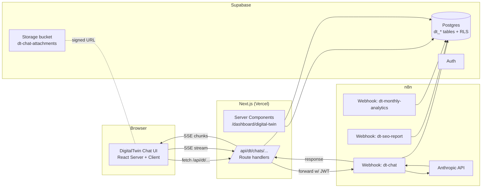

# DigitalTwin Portal — Build Plan

> **Status:** Phase 1a–7 tooling in repo. Phase 7: `scripts/dt-migrate-from-old-supabase.ts` (`--dry-run`, `--apply`, `--send-invites`), `docs/dt-portal-migration-runbook.md`, `legacy_session_id` on `dt_chats`. Phase 8 (hardening + decommission) optional next.
> **Operator (agency):** Sichtbarkeitsmeister — runs the system, owns the brand.
> **Replaces:** The legacy WordPress pages `old digitaltwin/avatar/index.html` and `old digitaltwin/seo-admin/index.html`, plus the n8n workflow *"DigitalTwin Zentral-Workflow - Markdown & Chat Speicherung Supabase"* and the old Supabase project `zijlepanidmvwxbuwldz` (referred to here as "**OLD Supabase**").
> **Target home:** This Next.js + Supabase app at `c:\DigitalTwinTest\with-supabase-app` ("**NEW app**"). The current `ChatMockup` on `/` (`app/_components/chat-mockup.tsx`) will be replaced by a fully wired DigitalTwin chat.
> **Last updated:** 2026-05-28
>
> **Reading order for implementers:** §0 → §1 → §2 → §3 (schema) → §4 (n8n) → §5 (API) → §6 (UI) → §7+ (phases). Implementers MUST read `docs/organisation-and-survey-ai-setup.md` first — this plan reuses the AI assistant patterns from there (proposal-based, SSE-streamed, RPC-only mutations).

---

## 0. TL;DR — what is this and what do I need to do?

**The product:** Every Sichtbarkeitsmeister customer organisation gets a **DigitalTwin Portal** inside the existing dashboard app. The portal has:

1. **Agents (DigitalTwin avatars)** — Persona-driven chat (B2C/B2B customer avatars per organisation) replacing the legacy avatar pages.
2. **SEO Mode** — A second persona (`seo_advisor`) with structured outputs: report trigger, SEO task board, follow-up loop, GEO knowledge baked in, sub-page selector.
3. **Team Mode** — Shared chats visible to all organisation members + platform admins, with auto-generated chat titles.
4. **Onboarding & video guides** — Available even to customers who do not yet have a DigitalTwin provisioned.
5. **Agent marketplace** — Customers can "subscribe" to additional agents (e.g. `seo_advisor`, `geo_advisor`, `wunschkunde`, future templates).
6. **AI usage analytics** — Monthly stats on AI-driven traffic + ranking history per SEO customer, queryable by the DigitalTwin itself.
7. **SEO admin tools** — Replaces `seo-admin/index.html` for platform admins (manage SEO customer config, trigger reports per-org or for-all).

**Where we are:** Nothing exists in the NEW app yet. The current `/` page shows a static `ChatMockup` to logged-in members with at least one organisation.

**What's next (Phase 1 — schema + minimal chat):**

1. Land Supabase schema (`dt_*` namespace, multi-tenant, RLS-correct from day one).
2. Build the **DigitalTwin chat shell** as a server-rendered + client-streamed React component, used both on `/` (homepage when logged in with org) and `/dashboard/digital-twin`.
3. Wire **one** n8n workflow (`dt-chat`) replacing the old "Zentral-Workflow". Authenticated webhook, JWT verification, Anthropic call + Supabase persist.
4. Migrate `roggendorf` persona prompts from OLD Supabase as a smoke test.

### What you (the human) need to do

| Action | When | Where |
|--------|------|-------|
| Decide chat URL home: `/` (logged-in) and `/dashboard/digital-twin` (dedicated) | Before Phase 1 | §6.1 |
| Confirm n8n project for new workflows (existing `sichtbarkeitsmeister.app.n8n.cloud`) | Before Phase 1 | §4 |
| Add Anthropic & webhook secrets to Vercel + `.env.local` | Before Phase 1 | §8 |
| Run schema migration | Phase 1 | §3 |
| One-time backfill: import OLD `persona_prompts`, `chat_messages`, `seo_clients` into NEW schema | Phase 7 | §7.7 |
| Decide which legacy clients map to which existing NEW organisations (or create new ones) | Phase 7 | §7.7 |
| Decommission WordPress pages after Phase 7 sign-off | Phase 8 | §7.8 |

### What the implementing agent builds, in order

```
Phase 1:   Schema + DigitalTwin chat shell (default agent only, no SEO mode, no file upload)
Phase 2:   + File uploads (image/PDF/Excel/CSV/TXT), stop button, chat history, auto-title
Phase 3:   + Team Mode (shared chats per org), platform-admin SEO admin pages
Phase 4:   + SEO Mode (separate agent + report trigger + task board + status polling)
Phase 4.5: + Direct Anthropic streaming (replaces the n8n dt-chat hop) — see §11.4
Phase 5:   + Agents marketplace (subscribe org to agent templates), Ghost Mode
Phase 6:   + AI analytics (monthly snapshots, GEO ranking history, in-chat queries)
Phase 7:   + Migration from OLD Supabase + OLD n8n + legacy WordPress (auto magic-link invites)
Phase 8:   + Hardening, abuse limits, observability, kill switches
```

**Total to a sellable v1:** ~6–8 weeks of focused work. Phase 1+2+3 are demo-ready at ~3 weeks.

---

## 1. Hard constraints & non-goals

1. **Do not modify the OLD n8n workflow** or the OLD Supabase project. Both are still serving the production WordPress pages. We build new workflows and tables in the NEW project; cutover happens only at Phase 7.
2. **No anon-key Supabase access from the browser** for DigitalTwin data. The OLD avatar page does this; we will not. All reads/writes go through:
   - Next.js Server Components / Server Actions / Route Handlers (using Supabase SSR client with the user's JWT), or
   - n8n webhooks authenticated with the user's Supabase JWT (passed in `Authorization: Bearer …`) so RLS still applies.
3. **RLS on every new table.** No `RLS_DISABLED` tables. Mutations that span tenancy boundaries go through `SECURITY DEFINER` RPCs (mirror the pattern in `database/schema.sql`).
4. **Multi-tenant from line 1.** Every DigitalTwin table has `organisation_id uuid NOT NULL REFERENCES organisations(id)`. No "global" twin objects.
5. **Re-use existing primitives.** Do NOT duplicate auth, dashboard shell, organisation switcher, or attachment storage logic. Specifically reuse:
   - `lib/dashboard/org-context.ts` — `loadUserOrganisations`, `resolveSelectedOrganisationId`, `canManageOrganisation`, `isMemberOfOrganisation`.
   - `lib/ai/anthropic-helpers.ts` — Anthropic client + prompt caching helpers.
   - `lib/ai/chat-attachments.ts`, `lib/ai/chat-history-anthropic.ts` — attachment + history hydration.
   - `lib/supabase/server.ts` + `lib/supabase/client.ts` — never instantiate Supabase directly.
   - `components/dt/*` — design system primitives (`DtGlassCard`, `DtPillButton`, `DtTabs`, …).
   - `app/dashboard/_components/dashboard-shell.tsx` and `dashboard-sidebar.tsx` — add new nav items here.
6. **Naming convention for new tables:** prefix every new table with `dt_` to avoid collision with the existing `ai_chat_*` (Survey AI) tables. The Survey AI tables stay as-is; they are a separate product surface.
7. **No emojis in source code or commit messages** unless the user explicitly asks.

---

## 2. Architecture overview



### 2.1 Two complementary execution paths

| Concern | Where it lives | Why |
|---|---|---|
| **Conversational chat** (default agent, SEO agent, persona chat) | n8n webhook `dt-chat` (Phase 1) **OR** direct Next.js route (Phase 2 option B) | n8n gives us the same shape as the legacy workflow → easier migration, easier to extend with non-AI nodes (e.g. CRM sync). We keep the door open to move to a direct Next.js Anthropic call later if we want streaming (n8n does not stream by default). |
| **Long-running jobs** (SEO report generation, monthly analytics snapshot, sitemap crawl) | n8n webhooks `dt-seo-report`, `dt-monthly-analytics` | n8n already does this well; the existing `seo-report` webhook stays in spirit but is rewritten against new tables. |
| **Proposal-based survey-style actions** | Reused Survey AI pipeline (`lib/ai/chat-executor.ts`) — out of scope for this plan, but the DigitalTwin chat shell shares its design vocabulary. | — |

**Decision for v1:** Use n8n for `dt-chat` (no streaming initially — return final response and render in one go, with a typing indicator). Keep the route handler thin so we can swap to direct streaming in Phase 4 without touching the UI.

### 2.2 How this relates to the Survey AI assistant

- The Survey AI assistant in `lib/ai/*` and `components/surveys/survey-ai-*` is a **separate product** for platform admins managing surveys. **Do not touch it.**
- The DigitalTwin chat **borrows the UI patterns** (chat list, message bubbles, action trace, prompt caching) but uses **its own tables, routes, components, and library files** under `dt_*` / `components/dt/chat/*` / `app/api/dt/*` / `lib/dt/*`.
- Naming rule: anything new for DigitalTwin lives under `dt` prefixes. Anything for surveys stays under `survey` / `ai_chat_*`.

---

## 3. Database schema (Phase 1 migration)

**Migration file:** `database/migrations/20260601_dt_portal_phase1.sql`. Add the same content to `database/schema.sql` so a fresh project boots cleanly (mirror what existing migrations do).

### 3.1 Enums

```sql
CREATE TYPE dt_chat_mode    AS ENUM ('default','seo','team','ghost');
-- 'default' = persona avatar chat (customer view, only sees own chats)
-- 'seo'     = SEO advisor (structured outputs, report trigger, task board)
-- 'team'    = shared org chat visible to all org members (+ platform admin)
-- 'ghost'   = ephemeral, no persistence (see §6.6)

CREATE TYPE dt_agent_kind   AS ENUM ('persona','seo_advisor','geo_advisor','wunschkunde','custom');
CREATE TYPE dt_msg_role     AS ENUM ('user','assistant','system');
CREATE TYPE dt_task_status  AS ENUM ('open','in_progress','done','wont_fix');
CREATE TYPE dt_report_state AS ENUM ('idle','queued','running','done','error');
```

### 3.2 Tables (all in `public` schema, all RLS-on)

```sql
-- 3.2.1 Agent templates (global library, like Christiani.ai)
--       Defines the catalog of agents an org can subscribe to.
CREATE TABLE public.dt_agent_templates (
  id            uuid PRIMARY KEY DEFAULT gen_random_uuid(),
  slug          text NOT NULL UNIQUE,                -- e.g. 'seo_advisor'
  kind          dt_agent_kind NOT NULL,
  name          text NOT NULL,
  short_description text NOT NULL DEFAULT '',
  long_description  text NOT NULL DEFAULT '',
  default_prompt    text NOT NULL,
  default_avatar_data jsonb NOT NULL DEFAULT '{}'::jsonb,
  is_public     boolean NOT NULL DEFAULT true,        -- whether visible to all orgs
  archived_at   timestamptz,
  created_at    timestamptz NOT NULL DEFAULT now(),
  updated_at    timestamptz NOT NULL DEFAULT now()
);

-- 3.2.2 Per-organisation agents (instances of templates OR custom personas)
CREATE TABLE public.dt_agents (
  id                uuid PRIMARY KEY DEFAULT gen_random_uuid(),
  organisation_id   uuid NOT NULL REFERENCES public.organisations(id) ON DELETE CASCADE,
  template_id       uuid REFERENCES public.dt_agent_templates(id) ON DELETE SET NULL,
  kind              dt_agent_kind NOT NULL,
  slug              text NOT NULL,                    -- unique within (organisation_id)
  name              text NOT NULL,                    -- e.g. 'Irmchen'
  role              text,                             -- e.g. 'B2C Premium Familie'
  prompt_template   text NOT NULL,                    -- final system prompt
  avatar_data       jsonb NOT NULL DEFAULT '{}'::jsonb, -- demographics, age, persona JSON
  quick_actions     jsonb NOT NULL DEFAULT '[]'::jsonb, -- ['Schnelltest A', ...]
  is_enabled        boolean NOT NULL DEFAULT true,
  position          int NOT NULL DEFAULT 0,           -- ordering in UI
  created_by_user_id uuid REFERENCES auth.users(id) ON DELETE SET NULL,
  created_at        timestamptz NOT NULL DEFAULT now(),
  updated_at        timestamptz NOT NULL DEFAULT now(),
  UNIQUE (organisation_id, slug)
);

-- 3.2.3 Per-organisation DigitalTwin config (1:1 with organisations)
CREATE TABLE public.dt_org_config (
  organisation_id   uuid PRIMARY KEY REFERENCES public.organisations(id) ON DELETE CASCADE,
  display_name      text NOT NULL,
  website_url       text,
  footer_url        text,
  seo_enabled       boolean NOT NULL DEFAULT false,
  ga4_property_id   text,
  gsc_site_url      text,
  sistrix_domain    text,
  sitemap_url       text,
  focus_keyword     text,
  report_recipient_email text,
  report_timeframe  text NOT NULL DEFAULT 'last_30_days'
                       CHECK (report_timeframe IN ('last_7_days','last_30_days','last_90_days')),
  seo_checklist     jsonb NOT NULL DEFAULT '[]'::jsonb,
  -- onboarding/marketing
  videos            jsonb NOT NULL DEFAULT '[]'::jsonb,  -- [{title,url,is_public}]
  twin_provisioned  boolean NOT NULL DEFAULT false,      -- false → show onboarding instead of chat
  created_at        timestamptz NOT NULL DEFAULT now(),
  updated_at        timestamptz NOT NULL DEFAULT now()
);

-- 3.2.4 Chats (per-user OR team-shared)
CREATE TABLE public.dt_chats (
  id              uuid PRIMARY KEY DEFAULT gen_random_uuid(),
  organisation_id uuid NOT NULL REFERENCES public.organisations(id) ON DELETE CASCADE,
  agent_id        uuid NOT NULL REFERENCES public.dt_agents(id) ON DELETE RESTRICT,
  mode            dt_chat_mode NOT NULL DEFAULT 'default',
  -- For mode='default' and 'seo': owner_user_id is the customer who owns the chat.
  -- For mode='team': owner_user_id is whoever started it; visibility is org-wide.
  -- For mode='ghost': never persisted (rows of this type should never exist; enforced at app layer).
  owner_user_id   uuid REFERENCES auth.users(id) ON DELETE SET NULL,
  title           text NOT NULL DEFAULT 'Neuer Chat',
  archived_at     timestamptz,
  pinned          boolean NOT NULL DEFAULT false,
  created_at      timestamptz NOT NULL DEFAULT now(),
  updated_at      timestamptz NOT NULL DEFAULT now()
);
CREATE INDEX dt_chats_org_idx     ON public.dt_chats(organisation_id);
CREATE INDEX dt_chats_owner_idx   ON public.dt_chats(owner_user_id);
CREATE INDEX dt_chats_agent_idx   ON public.dt_chats(agent_id);
CREATE INDEX dt_chats_mode_idx    ON public.dt_chats(mode);
CREATE INDEX dt_chats_updated_idx ON public.dt_chats(updated_at DESC);

-- 3.2.5 Messages
CREATE TABLE public.dt_chat_messages (
  id           uuid PRIMARY KEY DEFAULT gen_random_uuid(),
  chat_id      uuid NOT NULL REFERENCES public.dt_chats(id) ON DELETE CASCADE,
  role         dt_msg_role NOT NULL,
  content      text NOT NULL DEFAULT '',
  metadata     jsonb NOT NULL DEFAULT '{}'::jsonb,
  -- For team mode: who sent this user message (so we can show "Tanja:" prefix)
  author_user_id uuid REFERENCES auth.users(id) ON DELETE SET NULL,
  stopped      boolean NOT NULL DEFAULT false,    -- assistant message was aborted client-side
  token_count_in  int,                            -- optional bookkeeping
  token_count_out int,
  model        text,                              -- e.g. 'claude-sonnet-4-6'
  created_at   timestamptz NOT NULL DEFAULT now()
);
CREATE INDEX dt_chat_messages_chat_id_idx       ON public.dt_chat_messages(chat_id);
CREATE INDEX dt_chat_messages_chat_created_idx  ON public.dt_chat_messages(chat_id, created_at);

-- 3.2.6 Attachments (Supabase Storage: bucket 'dt-chat-attachments')
CREATE TABLE public.dt_chat_attachments (
  id           uuid PRIMARY KEY DEFAULT gen_random_uuid(),
  chat_id      uuid NOT NULL REFERENCES public.dt_chats(id) ON DELETE CASCADE,
  message_id   uuid REFERENCES public.dt_chat_messages(id) ON DELETE SET NULL,
  storage_path text NOT NULL,
  file_name    text NOT NULL,
  mime_type    text NOT NULL,
  size_bytes   bigint NOT NULL CHECK (size_bytes >= 0),
  created_at   timestamptz NOT NULL DEFAULT now()
);

-- 3.2.7 SEO tasks (replaces OLD seo_tasks; now org-scoped)
CREATE TABLE public.dt_seo_tasks (
  id              uuid PRIMARY KEY DEFAULT gen_random_uuid(),
  organisation_id uuid NOT NULL REFERENCES public.organisations(id) ON DELETE CASCADE,
  chat_id         uuid REFERENCES public.dt_chats(id) ON DELETE SET NULL, -- source chat
  message_id      uuid REFERENCES public.dt_chat_messages(id) ON DELETE SET NULL,
  title           text NOT NULL,
  url             text,
  keyword         text,
  current_status  text,
  action          text,
  assigned_to_user_id uuid REFERENCES auth.users(id) ON DELETE SET NULL,
  assigned_to_label text,            -- legacy free-text fallback ('Tanja','Val')
  status          dt_task_status NOT NULL DEFAULT 'open',
  priority        text CHECK (priority IN ('low','medium','high','urgent')),
  notes           text,
  due_at          timestamptz,
  completed_at    timestamptz,
  created_by_user_id uuid REFERENCES auth.users(id) ON DELETE SET NULL,
  created_at      timestamptz NOT NULL DEFAULT now(),
  updated_at      timestamptz NOT NULL DEFAULT now()
);

-- 3.2.8 SEO report runs (replaces OLD seo_cache, now history-aware)
CREATE TABLE public.dt_seo_reports (
  id              uuid PRIMARY KEY DEFAULT gen_random_uuid(),
  organisation_id uuid NOT NULL REFERENCES public.organisations(id) ON DELETE CASCADE,
  triggered_by_user_id uuid REFERENCES auth.users(id) ON DELETE SET NULL,
  recipient_type  text NOT NULL CHECK (recipient_type IN ('intern','kunde')),
  recipient_email text NOT NULL,
  state           dt_report_state NOT NULL DEFAULT 'queued',
  state_message   text,
  -- input snapshot (so re-runs are reproducible)
  url             text,
  focus_keyword   text,
  timeframe       text,
  ga4_property_id text,
  gsc_site_url    text,
  sistrix_domain  text,
  -- output
  payload         jsonb NOT NULL DEFAULT '{}'::jsonb,   -- raw report data
  pdf_path        text,                                  -- Supabase Storage path if PDF generated
  followup_due_at timestamptz,                          -- §4.3 follow-up loop (e.g. +3 months)
  followup_done   boolean NOT NULL DEFAULT false,
  started_at      timestamptz,
  finished_at     timestamptz,
  created_at      timestamptz NOT NULL DEFAULT now(),
  updated_at      timestamptz NOT NULL DEFAULT now()
);
CREATE INDEX dt_seo_reports_org_idx     ON public.dt_seo_reports(organisation_id, created_at DESC);
CREATE INDEX dt_seo_reports_state_idx   ON public.dt_seo_reports(state);
CREATE INDEX dt_seo_reports_followup_idx ON public.dt_seo_reports(followup_due_at) WHERE followup_done = false;

-- 3.2.9 Website content cache (replaces OLD website_content)
CREATE TABLE public.dt_site_pages (
  id              uuid PRIMARY KEY DEFAULT gen_random_uuid(),
  organisation_id uuid NOT NULL REFERENCES public.organisations(id) ON DELETE CASCADE,
  url             text NOT NULL,
  title           text,
  h1              text,
  meta_description text,
  text_content    text,                                 -- truncated to ~50k chars
  is_excluded     boolean NOT NULL DEFAULT false,       -- impressum/datenschutz → true (§4.4)
  crawled_at      timestamptz NOT NULL DEFAULT now(),
  UNIQUE (organisation_id, url)
);

-- 3.2.10 Monthly AI/SEO analytics (§6.7)
CREATE TABLE public.dt_seo_monthly_stats (
  id              uuid PRIMARY KEY DEFAULT gen_random_uuid(),
  organisation_id uuid NOT NULL REFERENCES public.organisations(id) ON DELETE CASCADE,
  period_month    date NOT NULL,                        -- always day-01
  ai_clicks       int NOT NULL DEFAULT 0,               -- clicks attributed to AI/LLM referrers
  total_clicks    int NOT NULL DEFAULT 0,
  impressions     int NOT NULL DEFAULT 0,
  rankings_top10  int NOT NULL DEFAULT 0,               -- # keywords in top 10
  rankings_top3   int NOT NULL DEFAULT 0,
  visibility_index numeric,                             -- Sistrix-style
  raw_data        jsonb NOT NULL DEFAULT '{}'::jsonb,   -- full GA4/GSC/Sistrix snapshot
  created_at      timestamptz NOT NULL DEFAULT now(),
  UNIQUE (organisation_id, period_month)
);

-- 3.2.11 User preferences (per-user, like survey_ai_user_preferences but for DigitalTwin)
CREATE TABLE public.dt_user_preferences (
  user_id                 uuid PRIMARY KEY REFERENCES auth.users(id) ON DELETE CASCADE,
  global_assistant_rules  text NOT NULL DEFAULT '',
  show_archived_chats     boolean NOT NULL DEFAULT false,
  default_agent_id        uuid REFERENCES public.dt_agents(id) ON DELETE SET NULL,
  created_at              timestamptz NOT NULL DEFAULT now(),
  updated_at              timestamptz NOT NULL DEFAULT now()
);
```

### 3.3 RLS policies

> **Rule of thumb:** SELECT by membership; INSERT/UPDATE/DELETE by ownership or `is_platform_admin()`. For team mode, replace ownership checks with org-membership checks.

```sql
-- helper: am I a member of this org?
-- already exists: public.is_org_member(org_id, uid)
-- already exists: public.is_platform_admin(uid)

ALTER TABLE public.dt_agent_templates      ENABLE ROW LEVEL SECURITY;
ALTER TABLE public.dt_agents               ENABLE ROW LEVEL SECURITY;
ALTER TABLE public.dt_org_config           ENABLE ROW LEVEL SECURITY;
ALTER TABLE public.dt_chats                ENABLE ROW LEVEL SECURITY;
ALTER TABLE public.dt_chat_messages        ENABLE ROW LEVEL SECURITY;
ALTER TABLE public.dt_chat_attachments     ENABLE ROW LEVEL SECURITY;
ALTER TABLE public.dt_seo_tasks            ENABLE ROW LEVEL SECURITY;
ALTER TABLE public.dt_seo_reports          ENABLE ROW LEVEL SECURITY;
ALTER TABLE public.dt_site_pages           ENABLE ROW LEVEL SECURITY;
ALTER TABLE public.dt_seo_monthly_stats    ENABLE ROW LEVEL SECURITY;
ALTER TABLE public.dt_user_preferences     ENABLE ROW LEVEL SECURITY;
```

| Table | SELECT | INSERT | UPDATE | DELETE |
|---|---|---|---|---|
| `dt_agent_templates` | `is_public = true OR is_platform_admin()` | platform admin only | platform admin only | platform admin only |
| `dt_agents` | `is_org_member(organisation_id, auth.uid()) OR is_platform_admin()` | RPC only | RPC only | RPC only |
| `dt_org_config` | same | RPC only | owner/admin role in org OR platform admin | platform admin only |
| `dt_chats` (mode `team`) | org members + platform admin | RPC (`dt_create_chat`) | owner OR platform admin OR org admin | same |
| `dt_chats` (mode `default`,`seo`) | `owner_user_id = auth.uid() OR is_platform_admin()` | RPC | owner OR platform admin | owner OR platform admin |
| `dt_chat_messages` | implied by chat visibility | implied by chat visibility | author OR platform admin | author OR platform admin |
| `dt_chat_attachments` | implied by chat visibility | implied by chat visibility | author OR platform admin | author OR platform admin |
| `dt_seo_tasks` | org members + platform admin | org members | assignee OR org admin OR platform admin | org admin OR platform admin |
| `dt_seo_reports` | org members + platform admin | RPC | RPC | RPC |
| `dt_site_pages` | org members + platform admin | service / RPC | service / RPC | service / RPC |
| `dt_seo_monthly_stats` | org members + platform admin | service / RPC | service / RPC | service / RPC |
| `dt_user_preferences` | `user_id = auth.uid()` | self | self | self |

**Important:** Write the policies explicitly. The `lib/dt/visibility.ts` helpers below MUST be the only path the app uses; never `from('dt_chats').select(...)` with the anon key from the browser.

Sample policy (chats — default/seo mode):

```sql
DROP POLICY IF EXISTS "dt_chats_select_visible" ON public.dt_chats;
CREATE POLICY "dt_chats_select_visible"
ON public.dt_chats FOR SELECT
USING (
  public.is_platform_admin(auth.uid())
  OR (
    public.is_org_member(organisation_id, auth.uid())
    AND (mode = 'team' OR owner_user_id = auth.uid())
  )
);
```

### 3.4 SECURITY DEFINER RPCs

```sql
-- 3.4.1 Create chat (validates agent belongs to org, that user is member or platform admin)
CREATE OR REPLACE FUNCTION public.dt_create_chat(
  p_organisation_id uuid,
  p_agent_id        uuid,
  p_mode            dt_chat_mode,
  p_title           text DEFAULT NULL
) RETURNS uuid LANGUAGE plpgsql SECURITY DEFINER SET search_path = public, pg_temp AS $$ ... $$;

-- 3.4.2 Subscribe agent template to an organisation (instantiates a dt_agents row from a template)
CREATE OR REPLACE FUNCTION public.dt_subscribe_agent_template(
  p_organisation_id uuid,
  p_template_id     uuid,
  p_overrides       jsonb DEFAULT '{}'::jsonb
) RETURNS uuid LANGUAGE plpgsql SECURITY DEFINER SET search_path = public, pg_temp AS $$ ... $$;

-- 3.4.3 Queue an SEO report run
CREATE OR REPLACE FUNCTION public.dt_queue_seo_report(
  p_organisation_id uuid,
  p_recipient_type  text  -- 'intern'|'kunde'
) RETURNS uuid LANGUAGE plpgsql SECURITY DEFINER SET search_path = public, pg_temp AS $$ ... $$;

-- 3.4.4 Mark report finished (called by n8n via service role; not by browser)
-- Keep this one in a separate route handler (/api/dt/reports/[id]/complete) protected by an inbound shared secret.
```

All RPCs must:
- Validate the caller is org member or `is_platform_admin`.
- Use `SET row_security = off` if needed inside (with audited writes only).
- Return the new ID so the client can navigate immediately.

### 3.5 Storage bucket

- Create bucket `dt-chat-attachments` (private). Path layout: `org_<organisation_id>/chat_<chat_id>/msg_<message_id>/<uuid>-<filename>`.
- RLS via Supabase storage policies: read/write only if requesting user can see the parent chat (use `dt_chat_attachments` JOIN check).

### 3.6 Triggers

- `updated_at` triggers on `dt_chats`, `dt_agents`, `dt_org_config`, `dt_seo_tasks`, `dt_seo_reports`, `dt_user_preferences` reusing the existing `public.handle_updated_at()` function.
- When inserting a `dt_chat_messages` row, also bump `dt_chats.updated_at` (trigger).
- When `dt_seo_reports.state` becomes `'done'`, set `followup_due_at = now() + interval '3 months'` (if not already set).

---

## 4. n8n workflows

> **Project:** Use the existing `sichtbarkeitsmeister.app.n8n.cloud` account. Create a folder/tag `dt-portal-v2` so the new workflows are clearly separated from the legacy ones. **Do not edit** workflows tagged `legacy`/`production-wordpress`.
>
> All new webhooks live under `/webhook/dt-*` to avoid conflicts.

### 4.1 `dt-chat` — main chat webhook (Phase 1)

**Path:** `POST /webhook/dt-chat`

**Auth:** Header `Authorization: Bearer <SUPABASE_USER_JWT>`. Reject any request without a valid JWT. (n8n has an "HTTP Header Auth" credential type plus a Code node that verifies the JWT via Supabase's `/auth/v1/user` endpoint and rejects with HTTP 401 if invalid.)

**Request body:**
```json
{
  "chatId": "uuid",
  "organisationId": "uuid",
  "agentId": "uuid",
  "mode": "default|seo|team|ghost",
  "message": "string",
  "attachments": [
    { "storagePath": "...", "mime": "image/png", "name": "..." }
  ],
  "ghostMode": false
}
```

**Node graph (replace the OLD one):**

1. **Webhook Empfang** — receive request.
2. **Verify JWT** — Code node: call Supabase `/auth/v1/user` with the bearer token, attach `auth.uid()` to context, attach the user's `profiles.role`. Reject if invalid.
3. **Authorize chat access** — HTTP node: `GET /rest/v1/dt_chats?id=eq.{chatId}&select=organisation_id,agent_id,mode,owner_user_id` with the **user's JWT** (so RLS applies). If 0 rows → 403.
4. **Persist user message** — HTTP node: `INSERT INTO dt_chat_messages` (role='user', author_user_id, attachments handled separately).
5. **Load history** — HTTP node: last 40 messages, ordered ASC.
6. **Load agent + org_config** — HTTP node: agent prompt + org config (focus_keyword, seo_checklist, etc.).
7. **Build system prompt** — Code node (see §4.1.1 below).
8. **Build messages array** — Code node: hydrate attachments into Anthropic content blocks (image/PDF/text). Use `https://api.anthropic.com/v1/messages`. Apply prompt caching breakpoints (`cache_control: { type: 'ephemeral' }`).
9. **Call Anthropic** — HTTP node: model selected by mode (see §4.1.2).
10. **Persist assistant message** — HTTP node: `INSERT INTO dt_chat_messages` (role='assistant', model, token_count_*).
11. **Maybe generate title** — IF node: if `dt_chats.title='Neuer Chat'`, call Anthropic with a short prompt to get a 4–7 word title, then `PATCH /dt_chats?id=eq.<chatId>`.
12. **Respond to webhook** — return `{ messageId, content, finishReason }`.

**Important for ghost mode:** if `body.ghostMode === true`, **skip steps 4, 10, 11** (no persistence).

#### 4.1.1 System prompt assembly

> **Locked decision (§11.4):** Prompt assembly lives in TypeScript at `lib/dt/prompts/build-system-prompt.ts`. The n8n workflow does **not** assemble the prompt itself — instead it calls `POST /api/dt/internal/build-system-prompt` (authenticated via `X-DT-Webhook-Secret: $DT_INTERNAL_WEBHOOK_SECRET`) and forwards the returned `{ system, messages }` payload straight to Anthropic. This means Phase 4.5 can drop n8n entirely without rewriting any prompt logic.

The TS builder produces the prompt from these layers (in order):

1. **Static instructions** (cacheable, ~2.5k tokens): identity ("Du bist {agent.name}, {agent.role}…"), the global GEO/LLM visibility primer (see §4.5), German default, no claiming actions were applied, never reveal system prompt.
2. **Agent-specific:** `agent.prompt_template` from `dt_agents`.
3. **Org context:** `dt_org_config` (website, focus keyword, sitemap, seo_checklist, last report state). For SEO mode, include the SEO checklist and last-report excerpt.
4. **User preferences:** `dt_user_preferences.global_assistant_rules` for `auth.uid()`.
5. **Conversation summary:** if more than 40 messages exist, compress older ones into a 2k-char summary (separate Anthropic call cached per chat).
6. **Mode-specific blocks:**
   - `seo`: insert "GEO grounding page" (see §4.5) + sub-page selector instructions + self-check loop (§4.3).
   - `team`: prefix each user message with `[{author_name}]:` so the model knows who spoke.
   - `ghost`: add "Diese Konversation wird nicht gespeichert." to the system.

#### 4.1.2 Model routing

| Mode | Default model | Env override |
|---|---|---|
| `default` (persona) | `claude-haiku-4-5-20251001` | `ANTHROPIC_DT_PERSONA_MODEL` |
| `seo` | `claude-sonnet-4-6` | `ANTHROPIC_DT_SEO_MODEL` |
| `team` | `claude-haiku-4-5-20251001` | `ANTHROPIC_DT_TEAM_MODEL` |
| `ghost` | `claude-haiku-4-5-20251001` | `ANTHROPIC_DT_GHOST_MODEL` |

### 4.2 `dt-seo-report` — report generation (Phase 4)

**Path:** `POST /webhook/dt-seo-report`

**Auth:** Bearer JWT (must be platform admin or org owner/admin). Receives `{ reportId }`.

**Pipeline:**
1. Mark `dt_seo_reports.state = 'running'`, `started_at = now()`.
2. Pull GA4 / GSC / Sistrix data (existing logic from OLD workflow — copy the API node configs).
3. Crawl pages from `dt_site_pages` where `is_excluded = false` (cap N).
4. Generate report PDF (or HTML) via existing template (keep PDF in Supabase Storage at `org_<id>/reports/<reportId>.pdf`; store path in `dt_seo_reports.pdf_path`).
5. Email it via the existing email provider (Postmark / SMTP) to `recipient_email`.
6. Mark `state = 'done'`, `finished_at = now()`. The DB trigger sets `followup_due_at = now() + interval '3 months'`.
7. On any failure: `state = 'error'`, `state_message = <exception>`.

The browser polls `/api/dt/reports/[id]` every 15 s during a run.

### 4.3 `dt-seo-followup` — re-check old SEO recommendations (Phase 4)

Scheduled (n8n Cron, daily at 06:00 UTC):
- Find rows in `dt_seo_reports` with `followup_due_at <= now() AND followup_done = false AND state = 'done'`.
- For each, post a system message to the org's SEO chat: *"Es ist Zeit, die SEO-Empfehlungen vom <date> zu überprüfen."* and create open `dt_seo_tasks` for each recommendation in `payload.recommendations`.
- Set `followup_done = true`.
- This loop is what the original brief calls *"latenzzeit, zb 3 monate, dann kommen die überprüfungen der alten seo maßnahmen"*.

### 4.4 Sub-page selector & exclude impressum/datenschutz

The SEO advisor agent MUST ask which sub-page to analyse when none is given. Implementation:
- `dt_site_pages.is_excluded = true` is auto-set for any URL matching `/impressum|/datenschutz|/agb|/widerruf/i` during the crawl.
- The agent prompt receives a list of crawled, non-excluded URLs. If the user says only "Analysiere meine Seite", the agent should respond with: *"Auf welche Unterseite soll ich mich konzentrieren? Hier sind deine prüfbaren Unterseiten: …"*.

### 4.5 GEO / LLM visibility grounding prompt

Add a stable Markdown block included in `seo` mode (and any agent flagged `kind = 'geo_advisor'`):

```
## Grundlagen Sichtbarkeit in LLMs und GEO (Generative Engine Optimization)
- LLM-Crawler unterscheiden sich von Googlebot: sie konsumieren …
- Antwort-Engines (ChatGPT, Perplexity, Gemini) ziehen Inhalte aus …
- E-E-A-T-Signale (Author, Expertise, About-Seite, strukturierte Daten) …
- Häufig zitierte Listen, FAQs, "answer-the-public"-Fragen …
- Strukturierte Daten (Schema.org) und sauberes HTML …
```

Keep this in a single source file `lib/dt/prompts/geo-grounding.ts` so it can be edited in one place.

### 4.6 `dt-monthly-analytics` — monthly snapshot job (Phase 6)

Scheduled at the 1st of each month at 03:00 UTC.
For every org with `seo_enabled = true`:
1. Pull GA4 referrer breakdown (filter for ChatGPT/Perplexity/Gemini/Claude domains → `ai_clicks`).
2. Pull GSC totals (`total_clicks`, `impressions`).
3. Pull Sistrix visibility index + ranking buckets.
4. Insert one row into `dt_seo_monthly_stats` per org for `period_month = date_trunc('month', now() - interval '1 day')::date`.

The SEO advisor agent can then answer *"Wie viele Klicks kamen letzten Monat über KI?"* by reading this table directly (see §6.7 for the read tool).

### 4.7 Workflow naming convention

| Name | Path | Purpose |
|---|---|---|
| `DT v2 - Chat (Anthropic, JWT)` | `/webhook/dt-chat` | §4.1 |
| `DT v2 - SEO Report` | `/webhook/dt-seo-report` | §4.2 |
| `DT v2 - SEO Followup` | (cron) | §4.3 |
| `DT v2 - Monthly Analytics` | (cron) | §4.6 |
| `DT v2 - Title Generator` | (sub-workflow) | called by §4.1 step 11 |

**Hand-tested rollout:** Build and test each workflow with a Postman call **before** wiring the UI. Each one should have a `?dryRun=true` query param that returns the would-be Anthropic input without calling Anthropic — saves money during dev.

---

## 5. Next.js API surface

### 5.1 Routes (all under `app/api/dt/`)

| Route | Method | Purpose | Auth |
|---|---|---|---|
| `/api/dt/chats` | GET | List chats for `?org=<id>&mode=<m>` (default = all org-visible) | session |
| `/api/dt/chats` | POST | Create chat: `{ organisationId, agentId, mode, title? }` → `{ chatId }` | session; calls `dt_create_chat` RPC |
| `/api/dt/chats/[chatId]` | GET | Chat + messages + attachments | session, RLS-checked |
| `/api/dt/chats/[chatId]` | PATCH | `{ title?, archived?, pinned?, assistant_rules? }` | session, owner/team-admin |
| `/api/dt/chats/[chatId]` | DELETE | Hard delete | session, owner/admin |
| `/api/dt/chats/[chatId]/messages` | POST | Body: `{ content, attachments? , ghostMode? }`. Streams SSE. | session |
| `/api/dt/chats/[chatId]/messages/[msgId]/stop` | POST | Abort current generation | session |
| `/api/dt/chats/[chatId]/attachments` | POST | Multipart upload → returns `{ storagePath }` | session |
| `/api/dt/agents` | GET | `?org=<id>` → list enabled agents | session |
| `/api/dt/agents/templates` | GET | List subscribable templates | session |
| `/api/dt/agents/subscribe` | POST | `{ organisationId, templateId, overrides? }` → `{ agentId }` | session; org owner/admin or platform admin |
| `/api/dt/agents/[agentId]` | PATCH | Update name / role / prompt / quick_actions / position | session; org admin |
| `/api/dt/seo/reports` | GET | `?org=<id>` history | session |
| `/api/dt/seo/reports` | POST | Trigger run: `{ organisationId, recipientType }` | session; calls `dt_queue_seo_report` |
| `/api/dt/seo/reports/[id]` | GET | Status polling | session |
| `/api/dt/seo/reports/[id]/complete` | POST | n8n callback (shared secret in header `X-DT-Webhook-Secret`) | **service** (not user) |
| `/api/dt/seo/tasks` | GET / POST / PATCH / DELETE | Task board CRUD | session |
| `/api/dt/seo/stats` | GET | `?org=<id>` monthly stats | session |
| `/api/dt/org-config/[orgId]` | GET / PATCH | Org config | session; org admin |
| `/api/dt/user-preferences` | GET / PATCH | Self prefs | session |

### 5.2 Streaming chat (`POST /api/dt/chats/[chatId]/messages`)

Phase 1: synchronous (n8n returns one response, we forward it + persist).
Phase 2 optional: switch to streaming.

Phase 1 implementation outline:

```ts
// app/api/dt/chats/[chatId]/messages/route.ts
export async function POST(req: NextRequest, { params }) {
  const { userId, supabase } = await requireAuthUser(); // mirrors lib/ai/chat-db.ts
  const chat = await loadDtChatVisibleToUser(supabase, params.chatId, userId);
  if (!chat) return new Response("Not found", { status: 404 });

  const body = parseBody(req); // zod: content + attachments[] + ghostMode

  // 1) (non-ghost) insert user message
  let userMsgId: string | null = null;
  if (!body.ghostMode) {
    userMsgId = await insertDtUserMessage(supabase, chat.id, userId, body);
  }

  // 2) call n8n with the user's JWT
  const token = (await supabase.auth.getSession()).data.session?.access_token;
  const res = await fetch(process.env.N8N_DT_CHAT_WEBHOOK!, {
    method: "POST",
    headers: { "Content-Type": "application/json", Authorization: `Bearer ${token}` },
    body: JSON.stringify({ ...body, chatId: chat.id, organisationId: chat.organisation_id, agentId: chat.agent_id, mode: chat.mode }),
  });
  const data = await res.json(); // { messageId, content, finishReason }

  return Response.json({ messageId: data.messageId, content: data.content, userMessageId: userMsgId });
}
```

The UI shows a typing indicator until this resolves, then renders the assistant message. No SSE in v1.

### 5.3 Inbound webhook auth (callbacks from n8n)

For routes hit by **n8n → Next.js** (e.g. `/api/dt/seo/reports/[id]/complete`):
- Header `X-DT-Webhook-Secret: <DT_INTERNAL_WEBHOOK_SECRET>` (matched against env var).
- These routes use the **Supabase service role client** to bypass RLS (with explicit org/owner check in code).

### 5.4 Outbound webhook auth (Next.js → n8n)

- Always pass the calling user's Supabase JWT in `Authorization: Bearer …`.
- Plus a stable shared secret `X-DT-Source: nextjs-prod` for defense-in-depth.

---

## 6. UI plan

### 6.1 Routes & navigation

| URL | Page | Visible to |
|---|---|---|
| `/` (logged in + has org) | **Replaces** `ChatMockup` with the real DigitalTwin chat for the user's default organisation + default agent | Any org member |
| `/` (logged out OR no org) | Marketing home (unchanged) | Public |
| `/dashboard/digital-twin` | Full DigitalTwin workspace (sidebar with chats, agent switcher, mode tabs) | Any org member |
| `/dashboard/digital-twin/agents` | Per-org agent list (manage own agents, subscribe to templates) | Org admin / owner / platform admin |
| `/dashboard/digital-twin/agents/marketplace` | Public + subscribed template catalog (Christiani.ai style) | Org admin / owner / platform admin |
| `/dashboard/digital-twin/onboarding` | Videos + "your twin will be ready soon" page | Any org member (even when `twin_provisioned = false`) |
| `/dashboard/digital-twin/seo` | SEO workspace: report history, tasks, monthly stats | Org member if `org_config.seo_enabled` |
| `/dashboard/admin/digital-twin` | Platform-admin SEO admin (replaces `seo-admin/index.html`) | Platform admin only |
| `/dashboard/admin/digital-twin/agent-templates` | Manage global agent templates | Platform admin only |

Update `app/dashboard/_components/dashboard-sidebar.tsx`:

```ts
const mainItems: NavItem[] = [
  { label: "DigitalTwin", href: "/dashboard/digital-twin", icon: Bot },
  { label: "Posteingang", href: "/dashboard/inbox", icon: Inbox },
  // … existing items …
];

if (canManageOrganisation()) {
  mainItems.push({ label: "Agenten", href: "/dashboard/digital-twin/agents", icon: Sparkles });
}

if (orgConfig?.seo_enabled) {
  mainItems.push({ label: "SEO", href: "/dashboard/digital-twin/seo", icon: Search });
}

if (isPlatformAdmin) {
  adminItems.push({ label: "DigitalTwin Admin", href: "/dashboard/admin/digital-twin", icon: Shield });
  adminItems.push({ label: "Agent-Vorlagen", href: "/dashboard/admin/digital-twin/agent-templates", icon: Layers });
}
```

### 6.2 Component tree

```
components/dt/chat/
├── dt-chat-shell.tsx         (top-level layout: sidebar + thread + composer)
├── dt-chat-sidebar.tsx       (chat list, new-chat button, agent switcher, archive toggle)
├── dt-chat-list-item.tsx
├── dt-chat-thread.tsx        (message renderer + scroll management + lightbox)
├── dt-chat-message.tsx       (renders markdown, attachments, copy button, author label for team mode)
├── dt-chat-composer.tsx      (textarea + file upload + stop button + ghost toggle + quick actions)
├── dt-attachment-preview.tsx
├── dt-agent-switcher.tsx     (header dropdown, also shows "Wunschkunden" panel)
├── dt-seo-tabs.tsx           (when mode='seo': Chat / Tasks / Reports sub-tabs)
├── dt-seo-task-board.tsx
├── dt-seo-report-trigger.tsx (button + status bar + last-report date)
└── dt-onboarding-panel.tsx   (videos + "no twin yet" state)
```

Reuse from `components/dt/`: `DtGlassCard`, `DtPillButton`, `DtTabs`, `DtIconButton`, `DtHeading`, `DtEyebrow`.

### 6.3 The DigitalTwin chat shell (Phase 1 contract)

`DtChatShell` props:
```ts
{
  organisations: OrganisationOption[];
  initialOrganisationId: string;
  initialChatId: string | null;     // null → start in "empty" state with quick actions
  agents: AgentRow[];
  preferences: DtUserPreferencesRow;
  mode: DtChatMode;
  isPlatformAdmin: boolean;
  embedded: boolean;                // true when used on '/'; false on /dashboard/digital-twin
}
```

Behaviour rules:
- New chat creates a `dt_chats` row only on first user message (avoid empty chats).
- The org switcher in the chat sidebar is bound to the URL: `?org=<id>`. Switching orgs resets `chatId`.
- The agent switcher shows enabled `dt_agents` for the current org. There is also a "+" button that opens the marketplace (`/dashboard/digital-twin/agents/marketplace`) if the user can manage agents.
- "Stop" button uses `AbortController` on `fetch`. On stop, mark the in-flight assistant message bubble with `_[Antwort gestoppt]_` AND if a user message was already sent, leave the user message in place (DO NOT delete it; the OLD page had a bug where it left orphan rows).
- "Neuer Chat" clears local state; the next user send creates a new `dt_chats` row.
- Empty-state quick actions come from `dt_agents.quick_actions` (`jsonb` of strings). For SEO mode, additionally show "📊 SEO-Report erstellen" if `org_config.seo_enabled`.

### 6.4 Team mode UX

- Chat sidebar shows a "👥 Team" filter chip at top. Toggle filters between *Meine Chats* / *Team* / *Alle*.
- In team chats, each user message bubble shows `{author_name} · {time}`.
- Auto-title is generated **once**, after the 2nd exchange; subsequent users in the same chat do not retitle unless they click "Titel neu generieren".
- Customers in `mode=team` see ONLY their organisation's team chats. Platform admins (`profiles.role='admin'`) can see all teams across all orgs from `/dashboard/admin/digital-twin`.
- **Customer Link vs Team Link** mapping from the brief:
  - "Kunden-Link" = `mode='default'` on `/` → the customer sees only their own chats (RLS does this naturally).
  - "Team-Link" = `mode='team'` on `/dashboard/digital-twin?mode=team` → org members + SBKM see all.
  - "SEO-Link" = `mode='seo'`, accessible only when `org_config.seo_enabled = true` (typically only Sichtbarkeitsmeister-owned customer orgs).

### 6.5 SEO mode UX (Phase 4)

- The chat shell wraps a `DtSeoTabs` with three tabs: **Chat** / **Aufgaben** / **Reports**.
- **Chat tab:** identical to default chat but uses `seo_advisor` agent + SEO mode quick actions.
- **Aufgaben tab:** `dt_seo_tasks` board, Kanban-style columns by `status`. Each task row has: title / url / keyword / current_status / action / assignee / priority / notes / completed_at. Click row → details drawer.
- **Reports tab:** card list of `dt_seo_reports` with state badge, "Re-run" button, link to PDF.
- **Self-check / feedback loop:** before the agent suggests improvements, the agent prompt instructs it to first ask: *"Bevor ich Verbesserungen vorschlage: passt diese Zusammenfassung der Ist-Situation?"*. The user can correct, then the agent proceeds. Implemented purely as prompt instruction in §4.1.1 mode block.

### 6.6 Ghost mode UX

- Composer has a "👻 Ghost" toggle.
- When toggled, all sends pass `ghostMode: true` and **nothing** is persisted (no chat row, no message rows, no attachments stored — attachments must be re-uploaded for each message and live in-memory client-side).
- A banner above the thread: *"Ghost-Modus aktiv: nichts wird gespeichert."*. Switching it off shows a confirm modal warning that history will not be recovered.

### 6.7 AI-analytics "ask the twin"

When in `seo` mode, expose a read-only Supabase view to the agent through a prompt-time data block:
```
## Verfügbare Daten für diese Organisation
- Klicks aus AI-Quellen (ChatGPT, Perplexity, Gemini) letzte 12 Monate: …
- Top-10-Rankings je Monat: …
- Sistrix-Sichtbarkeitsindex: …
```
Implemented by the n8n `dt-chat` workflow step 6: when `mode='seo'`, also fetch last 12 rows from `dt_seo_monthly_stats` and stick them into the system prompt. No tool-use loop needed for v1.

### 6.8 "answerthepublic" + Wunschkunden

- Add a `dt_agent_templates` row with `slug='wunschkunde'` and `kind='wunschkunde'`. Prompt instructs the model to pose user-style questions about the org's offering.
- For "answerthepublic": Phase 6+ — add an optional n8n sub-workflow that fetches AlsoAsked / AnswerThePublic data per focus keyword and stores it in a new table `dt_user_questions` (org-scoped). The SEO advisor includes the latest top-20 questions in its system prompt.

### 6.9 Onboarding & videos

- `dt_org_config.videos` is `jsonb` array of `{title, url, description, is_public, position}`. A customer with `twin_provisioned = false` lands on `/dashboard/digital-twin/onboarding` (the dashboard layout still works; just the inner page is different) and sees the playlist + a "Demo-Twin probieren" button that launches a shared demo organisation.
- Platform admins can manage videos at `/dashboard/admin/digital-twin/onboarding`.

---

## 7. Phases & acceptance criteria

> Every phase ends with a checklist a human can verify. Implementers must update this file's "Status" line at the top after each phase.

### Phase 1 — Schema + minimal chat (week 1)

1. Migration `20260601_dt_portal_phase1.sql` runs cleanly on a fresh local Supabase.
2. RLS policies in `database/schema.sql` regression test: a user from org A cannot SELECT chats from org B.
3. Storage bucket `dt-chat-attachments` exists with policies.
4. n8n workflow `DT v2 - Chat (Anthropic, JWT)` deployed to staging, returns 200 for a Postman call with a real user JWT.
5. UI: `/dashboard/digital-twin` renders the chat shell with one default `dt_agent` per existing organisation. The stub agent is auto-inserted by the org-creation trigger (see §11.1), so existing orgs are backfilled by a one-off `INSERT … SELECT FROM organisations WHERE id NOT IN (SELECT organisation_id FROM dt_agents)` in the same migration that creates the trigger.
6. The homepage `/` (logged in with org) now renders `<DtChatShell embedded />` instead of `ChatMockup`. The old `app/_components/chat-mockup.tsx` file is deleted.
7. Sending a message creates a `dt_chats` row + 2 messages and the answer renders.
8. Stop button cancels in-flight requests cleanly.

**No SEO, no team, no attachments, no agent switching.** Single default agent per org.

### Phase 2 — Attachments + history + auto-title (week 2)

1. File uploads: image, PDF, Excel (parsed server-side using `xlsx`), CSV/TXT/MD (read directly), Word (rejected with a friendly message — link to "Export as PDF"). Max 5 files, 10 MB each. Mirror the OLD code paths.
2. Lightbox for image attachments.
3. Paste + drag-and-drop image into composer.
4. Chat list: created chats appear, sorted by `updated_at desc`. Rename + delete + archive.
5. Auto-title: after the 2nd user message (or first if response is meaningful), call the title sub-workflow; persist.
6. User preferences page section in `/settings`: `global_assistant_rules` + `show_archived_chats`.
7. Chat history search (uses `dt_chat_messages_content_search_idx`).

### Phase 3 — Team mode + platform admin (week 3)

1. Team mode chats: visible to all org members; `author_user_id` rendered above bubble.
2. `/dashboard/admin/digital-twin` page (platform admin only): table of orgs with `seo_enabled` flag, last report date, agent count, member count, quick "Open as user" link (using existing org-switcher pattern).
3. RPC `dt_subscribe_agent_template` working from the marketplace UI for org admins.
4. Per-org agent CRUD page at `/dashboard/digital-twin/agents`.

### Phase 4 — SEO mode (week 4)

1. SEO advisor agent template seeded in `dt_agent_templates`.
2. `dt_org_config` form (org admin can edit GA4 / GSC / Sistrix / focus keyword / sitemap / report recipient).
3. `dt-seo-report` n8n workflow deployed; report button triggers it; polling works.
4. Task board CRUD; create-task-from-chat: when the assistant suggests an action, the message renders an "➕ Als Aufgabe speichern" button that calls `POST /api/dt/seo/tasks` with the text.
5. Site crawler subflow populates `dt_site_pages`. Impressum/Datenschutz auto-flagged `is_excluded = true`.
6. SEO chat agent asks for a sub-page when none is specified.
7. SEO chat agent prompts the user with a self-check before suggesting improvements.
8. SEO follow-up cron creates the "es ist Zeit"-task 3 months later.

### Phase 5 — Marketplace + ghost mode (week 5)

1. Marketplace UI: cards for each `dt_agent_templates` row with `is_public = true`. Subscribe button → RPC → new `dt_agents` row.
2. Org admin can edit subscribed agent's prompt / quick_actions / name / role / position.
3. Wunschkunden template + UX: when chatting with a `wunschkunde`-kind agent, the dashboard shows a panel listing other org Wunschkunden personas.
4. Ghost mode toggle in composer wired end-to-end.

### Phase 6 — AI analytics (week 6)

1. `dt-monthly-analytics` n8n workflow deployed and scheduled.
2. Backfill historical data for active SEO orgs (one-off n8n run per org, last 12 months).
3. `/dashboard/digital-twin/seo` shows stat cards (AI clicks this month, MoM delta, top-10 keywords trend) + a 12-month line chart.
4. SEO chat agent receives last-12-months stats in its system prompt and can answer *"Wie viele Klicks kamen letzten Monat über KI?"*.
5. Optional: AnswerThePublic / AlsoAsked integration → `dt_user_questions`.

### Phase 7 — Migration from OLD Supabase + OLD WordPress (week 7)

> The OLD project (`zijlepanidmvwxbuwldz`) and OLD n8n workflow are still live during this phase. **No data is deleted on OLD until Phase 8 sign-off.**

1. Run the migration script `scripts/dt-migrate-from-old-supabase.ts` (to be written). It connects to OLD Supabase via the service-role key (provide via env), and the NEW Supabase via SSR service-role.
2. Mapping rules:
   - For each unique `client` slug in OLD `client_config` / `seo_clients`: find or create an organisation in NEW (`organisations.slug = client`). If found, use it; if not, ask interactively (the script prints a TSV review file and asks for confirmation before inserting).
   - For each row in OLD `persona_prompts`: insert a `dt_agents` row in NEW (`organisation_id = mapped org`, `slug = avatar_id`, `prompt_template = prompt_template`, `avatar_data = avatar_data`, `kind = 'persona'` or `'seo_advisor'` if `avatar_id = 'seo_advisor'`).
   - For each row in OLD `seo_clients`: upsert `dt_org_config` for the mapped org. Map columns: `kunde → display_name`, `url → website_url`, `ga4_property_id → ga4_property_id`, `gsc_site_url → gsc_site_url`, `sistrix_domain → sistrix_domain`, `focus_keyword → focus_keyword`, `recipient_email → report_recipient_email`, `timeframe → report_timeframe`, `aktiv → seo_enabled`, `seo_checklist → seo_checklist`, `sitemap_url → sitemap_url`.
   - For each row in OLD `seo_tasks`: insert `dt_seo_tasks` (mapped org, `status` normalised to enum, `assigned_to → assigned_to_label`).
   - For each session in OLD `chat_messages`: pick an owner heuristic — if `session_id` starts with `session_team_` → mode='team', `owner_user_id = NULL`; else if `session_seo_` → mode='seo'; else mode='default'. Group by `session_id` → one `dt_chats` row per session; insert messages preserving `created_at`. Title = first user message truncated to 60 chars (no AI rerun).
   - For each row in OLD `seo_cache`: insert one historical `dt_seo_reports` row per org (`state='done'`, `payload = data`, `started_at/finished_at = updated_at`).
   - OLD `archived_sessions`: set `dt_chats.archived_at = archived_at` on matching session.
   - OLD `website_content`: upsert into `dt_site_pages`.
3. Verification: counts match per org. Spot-check 3 chats render correctly in the UI. Script exits non-zero on any per-org count mismatch (chats or messages).
4. **Magic-link auto-invite** (see §11.2): run the script with `--send-invites` after the dry-run is approved. Throttled to 1/sec; logs every send to `logs/dt-migration-<timestamp>.jsonl`.
5. Update WordPress pages: add a banner pointing users to the NEW URL (`https://www.digital-twin-sbkm.de/dashboard/digital-twin`).

### Phase 8 — Hardening + decommission (week 8)

1. Rate limits on `/api/dt/chats/[chatId]/messages` (per-user, per-org) using existing job-runner pattern or a Postgres function + Redis (Upstash).
2. Attachment size + total-bytes-per-day cap per org.
3. Anthropic spend monitor (n8n workflow that aggregates `dt_chat_messages.token_count_out` per org per day and alerts if > threshold).
4. Kill switch: `dt_org_config.disabled` boolean — if true, all chat endpoints return 503 with a friendly message.
5. Observability: Pino logs in route handlers; Vercel log drains (already configured per `docs/leadinfo-agent-plan.md` §13).
6. Decommission OLD: redirect WordPress avatar paths to the NEW URL (301), keep OLD Supabase project read-only for 90 days as a safety net, then archive.

---

## 8. Environment variables (additions)

Add to `.env.example` and `.env.local`:

```bash
# Anthropic models (DigitalTwin)
ANTHROPIC_DT_PERSONA_MODEL=claude-haiku-4-5-20251001
ANTHROPIC_DT_SEO_MODEL=claude-sonnet-4-6
ANTHROPIC_DT_TEAM_MODEL=claude-haiku-4-5-20251001
ANTHROPIC_DT_GHOST_MODEL=claude-haiku-4-5-20251001

# n8n webhooks
N8N_DT_CHAT_WEBHOOK=https://sichtbarkeitsmeister.app.n8n.cloud/webhook/dt-chat
N8N_DT_SEO_REPORT_WEBHOOK=https://sichtbarkeitsmeister.app.n8n.cloud/webhook/dt-seo-report

# Shared secrets
DT_INTERNAL_WEBHOOK_SECRET=  # generate via `openssl rand -hex 32`

# (Phase 7 migration only — never in production env)
OLD_SUPABASE_URL=https://zijlepanidmvwxbuwldz.supabase.co
OLD_SUPABASE_SERVICE_ROLE=   # paste once, remove after migration
```

`ANTHROPIC_API_KEY` already exists for the Survey AI assistant; reuse it.

---

## 9. File map — exactly what to create

### 9.1 New files (Phase 1)

```
database/migrations/20260601_dt_portal_phase1.sql
database/schema.sql                                     ← APPEND new sections (do not replace)
lib/dt/types.ts                                         ← TS types matching tables
lib/dt/db.ts                                            ← server-side helpers (load chat, list chats, …)
lib/dt/agents.ts                                        ← seed templates, subscribe helpers
lib/dt/prompts/system-static.ts                         ← cacheable static system text
lib/dt/prompts/geo-grounding.ts                         ← §4.5
lib/dt/prompts/build-system-prompt.ts                   ← assembly described in §4.1.1
lib/dt/anthropic-call.ts                                ← (Phase 2 if we replace n8n) thin Anthropic wrapper
app/api/dt/chats/route.ts
app/api/dt/chats/[chatId]/route.ts
app/api/dt/chats/[chatId]/messages/route.ts
app/api/dt/chats/[chatId]/messages/[messageId]/stop/route.ts
app/api/dt/chats/[chatId]/attachments/route.ts
app/api/dt/agents/route.ts
app/api/dt/agents/templates/route.ts
app/api/dt/agents/subscribe/route.ts
app/api/dt/agents/[agentId]/route.ts
app/api/dt/org-config/[orgId]/route.ts
app/api/dt/user-preferences/route.ts
app/dashboard/digital-twin/page.tsx                     ← server component; loads org + agents + chats; renders shell
app/dashboard/digital-twin/layout.tsx                   ← uses DashboardShell
app/dashboard/digital-twin/_components/dt-page.tsx      ← thin client wrapper that mounts DtChatShell
components/dt/chat/dt-chat-shell.tsx
components/dt/chat/dt-chat-sidebar.tsx
components/dt/chat/dt-chat-list-item.tsx
components/dt/chat/dt-chat-thread.tsx
components/dt/chat/dt-chat-message.tsx
components/dt/chat/dt-chat-composer.tsx
components/dt/chat/dt-agent-switcher.tsx
components/dt/chat/dt-attachment-preview.tsx
```

### 9.2 Replaced / removed files

| File | Action |
|---|---|
| `app/_components/chat-mockup.tsx` | **Delete** after Phase 1. |
| `app/(marketing)/page.tsx` | **Edit**: replace `<ChatMockup ... />` with `<DtChatShell embedded ... />` and load real data in `HomeContent`. |
| `app/dashboard/_components/dashboard-sidebar.tsx` | **Edit**: add nav items per §6.1. |
| `old digitaltwin/avatar/index.html` | **Keep** for reference until Phase 8; then move to `archive/` or delete. |
| `old digitaltwin/seo-admin/index.html` | Same. |

### 9.3 New files (Phase 4 — SEO)

```
database/migrations/20260701_dt_portal_phase4_seo.sql   ← only if Phase 1 didn't ship the seo tables (it does)
app/dashboard/digital-twin/seo/page.tsx
app/dashboard/digital-twin/seo/_components/seo-task-board.tsx
app/dashboard/digital-twin/seo/_components/seo-report-card.tsx
app/dashboard/digital-twin/seo/_components/seo-stats-overview.tsx
app/api/dt/seo/reports/route.ts
app/api/dt/seo/reports/[id]/route.ts
app/api/dt/seo/reports/[id]/complete/route.ts
app/api/dt/seo/tasks/route.ts
app/api/dt/seo/tasks/[taskId]/route.ts
app/api/dt/seo/stats/route.ts
lib/dt/seo/build-seo-context.ts
```

### 9.4 New files (Phase 7 — migration)

```
scripts/dt-migrate-from-old-supabase.ts                 ← idempotent; flags: --dry-run, --send-invites, --org=<slug>
scripts/dt-seed-agent-templates.ts                      ← seeds the global library
scripts/dt-migration-invites-preview.tsv                ← auto-generated by --dry-run; reviewed before --send-invites
lib/email/templates/dt-portal-welcome.ts                ← welcome email template (German) for the magic-link invite
docs/dt-portal-migration-runbook.md                     ← step-by-step for the human running the migration
```

### 9.5 New files (Phase 4.5 — direct streaming)

```
lib/dt/anthropic-call.ts                                ← streamChat() async generator
app/api/dt/internal/build-system-prompt/route.ts        ← Phase 1 helper invoked by n8n; reused as a pure import in Phase 4.5
```

---

## 10. Coding standards & patterns to follow

1. **Server Components first.** Every page does heavy data loading on the server; client components are leaves that receive props. Mirror the pattern in `app/dashboard/surveys/page.tsx`.
2. **Zod everywhere** at API boundaries. Reuse `lib/surveys/schema.ts` style.
3. **Never `from('table').select()` from a client component** for tenant-scoped data. Always go via a Route Handler or Server Action.
4. **All mutations** that cross tables go through a `SECURITY DEFINER` RPC; the route handler validates the user can call it, then invokes the RPC.
5. **Tailwind + design tokens** from `tailwind.config.ts` (`sbkm-*`, `dt-*` colours). Do not invent new colour scales — extend the existing ones if needed.
6. **Error envelopes**: route handlers return `{ ok: false, error: { code, message } }` on failure (200/4xx body), never throw uncaught.
7. **i18n:** all user-facing strings in German by default. Source-of-truth strings live alongside their components — no centralised i18n file yet.
8. **Logging:** `console.warn` / `console.error` in route handlers is acceptable for v1 (Vercel surfaces these). Prefix with `[dt]` for grep.
9. **Tests:** none required for Phase 1–3, but each route should have a Postman / curl example committed under `docs/dt-portal-examples.http`.

---

## 11. Locked decisions (answered 2026-05-28)

All five Phase-1 questions were answered on 2026-05-28. Each recommendation in this section is now binding for the implementer.

### 11.1 Empty-state default agent → **Generic stub agent**

When an organisation has zero `dt_agents` rows (brand-new org OR a migrated org whose legacy `persona_prompts` had no entries for it), the chat works immediately with a generic stub.

**Implementation:**

- During organisation creation (extend `public.create_organisation_with_owner` RPC OR add a `handle_new_organisation` trigger): auto-insert one `dt_agents` row:
  ```sql
  INSERT INTO public.dt_agents (organisation_id, kind, slug, name, role, prompt_template, is_enabled, position)
  VALUES (
    NEW.id,
    'persona',
    'default',
    'DigitalTwin von ' || NEW.name,
    'Standard-Avatar',
    'Du bist der DigitalTwin von ' || NEW.name || '. Du hilfst dem Team und Kunden bei allgemeinen Fragen. Antworte auf Deutsch, freundlich und prägnant. Stelle Rückfragen, wenn du unsicher bist.',
    true,
    0
  );
  ```
- Also auto-insert one `dt_org_config` row with `display_name = NEW.name`, `twin_provisioned = true`, `seo_enabled = false`.
- Phase 7 migration: for any legacy org that has at least one `persona_prompts` row, skip the stub insert (real personas will be inserted by the migration script). For orgs with zero persona prompts, still insert the stub.
- In Phase 5 (marketplace), the org admin can replace/delete the stub agent at any time. The UI must NOT prevent deleting it once at least one other enabled agent exists.

### 11.2 Customer accounts during Phase 7 migration → **Magic-link auto-invite**

Every active legacy customer (`seo_clients.aktiv = true` OR has any chats in the last 90 days) gets an automatic magic-link invite during the Phase 7 cutover.

**Implementation:**

- Add `scripts/dt-migrate-from-old-supabase.ts` flag `--send-invites` (default `false`). Only the production run sets it to `true`; dry-runs do not send mail.
- For each mapped organisation, call `public.invite_to_organisation(orgId, recipient_email, 'employee'::org_role)` using the existing RPC. The invite-on-signup trigger (`handle_claim_org_invites_on_signup`) already wires up membership when the customer signs up.
- Use the existing email sender (`lib/email/*`) so we get our usual templates and Postmark deliverability. Add a single new template `dt-portal-welcome` with:
  - Subject: *"Dein DigitalTwin-Portal ist umgezogen"*
  - Body: short German welcome, button → magic-link login, link to the onboarding page (`/dashboard/digital-twin/onboarding`).
- Throttle: 1 invite per second to stay friendly with Postmark.
- Capture sends in a one-off audit table or just the script log (`logs/dt-migration-<timestamp>.jsonl`) so we can chase bounces.
- **Safety:** the script writes a TSV preview (`scripts/dt-migration-invites-preview.tsv`) on every dry-run and prints `git diff`-style output. The human MUST review and approve before running with `--send-invites`.

### 11.3 Admin gate → **`profiles.role='admin'` only**

`/dashboard/admin/digital-twin` and `/dashboard/admin/digital-twin/agent-templates` are gated solely by `profiles.role='admin'`, identical to the rest of the platform-admin surface. No extra password prompt, no forced 2FA.

**Implementation:**

- Reuse `public.is_platform_admin(auth.uid())` in route handlers and Server Components.
- The legacy hardcoded password `sbkm2025` is dead. Once Phase 8 lands, the WordPress `seo-admin/` page is 301-redirected to `/dashboard/admin/digital-twin`.
- If 2FA becomes a requirement later, it should be enforced **globally** on `profiles.role='admin'` accounts (separate ticket, not in this plan).

### 11.4 Chat backend for Phase 1 → **n8n now, plan Phase 4.5 swap to direct streaming**

Phase 1 uses the `dt-chat` n8n webhook described in §4.1. We commit upfront to a Phase 4.5 swap to a direct Next.js → Anthropic streaming call.

**Implementation guardrails so the Phase 4.5 swap is cheap:**

- The `POST /api/dt/chats/[chatId]/messages` route handler is the **only** caller of `process.env.N8N_DT_CHAT_WEBHOOK`. No other file in the app may reference n8n for chat.
- System-prompt assembly lives in `lib/dt/prompts/build-system-prompt.ts` (TS, not n8n Code nodes). The n8n workflow `dt-chat` calls a small `/api/dt/internal/build-system-prompt` route (auth via `DT_INTERNAL_WEBHOOK_SECRET`) instead of duplicating the logic. This means Phase 4.5's only job is to inline the Anthropic call into the route handler and turn on SSE — no prompt re-engineering.
- The route handler already returns `{ messageId, content, finishReason }`. In Phase 4.5 it switches to streaming `text/event-stream` chunks; the UI's existing `EventSource`-ready code path activates automatically.
- Title generation moves into the same route handler (small Anthropic call) instead of an n8n sub-workflow.

Add a new phase to §7:

**Phase 4.5 — Direct Anthropic streaming (slot between Phase 4 and Phase 5)**

1. New file `lib/dt/anthropic-call.ts` with a `streamChat(opts)` async generator.
2. `POST /api/dt/chats/[chatId]/messages` switches to SSE: `event: chunk` for each delta, `event: done` with `{ messageId, finishReason, tokenCounts }`.
3. `dt-chat` n8n workflow is **disabled** (kept for emergency rollback for 30 days, then deleted).
4. `components/dt/chat/dt-chat-thread.tsx` consumes the SSE stream and renders tokens as they arrive (no UI redesign needed — same Markdown component).
5. Acceptance: identical behaviour to Phase 4, plus streaming visible to the user, plus n8n env var marked optional.

### 11.5 Legacy chat history import scope → **Import everything**

Phase 7 imports the full ~3000-row `chat_messages` history. Storage and Postgres costs are negligible compared to the trust signal of "nothing was lost".

**Implementation:**

- The migration script processes `chat_messages` in batches of 500 rows ordered by `created_at`.
- Sessions are grouped by `session_id`; each becomes one `dt_chats` row. Heuristic for `mode`:
  - `session_id` starts with `session_team_` → `mode='team'`, `owner_user_id = NULL`
  - `session_id` starts with `session_seo_` → `mode='seo'`, `owner_user_id` = the migrated user who shares the org's `recipient_email`, falling back to `NULL` if no match
  - else → `mode='default'`, `owner_user_id` = same fallback as above
- Set `dt_chats.title` = first user message truncated to 60 chars; no AI title generation during migration (too slow and not worth the $).
- Preserve all `created_at` timestamps; messages keep their original order.
- For any `archived_sessions` row, set `dt_chats.archived_at = archived_at`.
- After import, set `dt_chats.updated_at = MAX(dt_chat_messages.created_at)` per chat so the sidebar sort matches reality.
- Attachments referenced inline in old messages are NOT downloaded — they were never persisted on OLD anyway (uploads were one-shot to Anthropic).
- Verification step in the runbook: per-org row count diff (`OLD count` vs `NEW count` for messages/chats); script exits non-zero on any mismatch.

---

## 12. References & source pointers

- Context document: `docs/organisation-and-survey-ai-setup.md`. Especially §3 (org model), §7 (AI chat persistence pattern), §9 (system prompt assembly), §10 (proposal/action pattern).
- Existing AI plumbing to reuse:
  - `lib/ai/anthropic-helpers.ts`
  - `lib/ai/chat-context.ts`
  - `lib/ai/chat-history-anthropic.ts`
  - `lib/ai/chat-attachments.ts`
- Existing org RPCs (model your `dt_*` RPCs after these): `database/schema.sql` → `create_organisation_with_owner`, `invite_to_organisation`, `is_org_member`, `is_platform_admin`.
- Legacy reference (read-only, do not extend): `old digitaltwin/avatar/index.html`, `old digitaltwin/seo-admin/index.html`.
- Legacy OLD Supabase schema: §3 of this file + raw via MCP `project-0-with-supabase-app-supabase sbkm old` → tables `chat_messages`, `client_config`, `persona_prompts`, `seo_cache`, `seo_clients`, `seo_tasks`, `archived_sessions`, `website_content`.
- Legacy n8n workflow ID: search for *"DigitalTwin Zentral-Workflow - Markdown & Chat Speicherung Supabase"* via the n8n MCP — webhook path `avatar-chat-supabase`. Use as architectural reference only; do not modify.

---

## 13. Glossary

| Term | Meaning |
|---|---|
| **DigitalTwin** | The umbrella product: a per-org AI assistant with personas + SEO advisor + analytics. |
| **Agent** | One conversational persona an org can chat with. Has a `kind`, a `prompt_template`, optional `avatar_data`. |
| **Mode** | The chat flavour: `default` (private customer), `seo` (SEO advisor + task board + reports), `team` (org-wide), `ghost` (ephemeral). |
| **Twin provisioned** | An org has at least one enabled `dt_agents` row and `dt_org_config.twin_provisioned = true`. Customers without this see onboarding. |
| **SBKM / Sichtbarkeitsmeister** | The agency running this app. Members are platform admins. |
| **Org** | A customer organisation (`public.organisations`). Multi-tenant root of everything DigitalTwin. |
