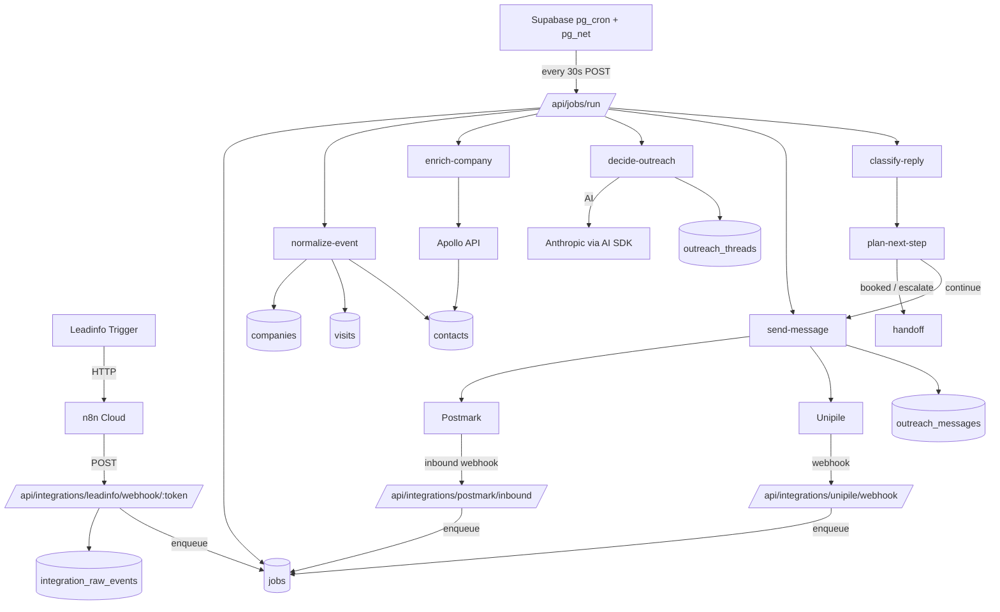
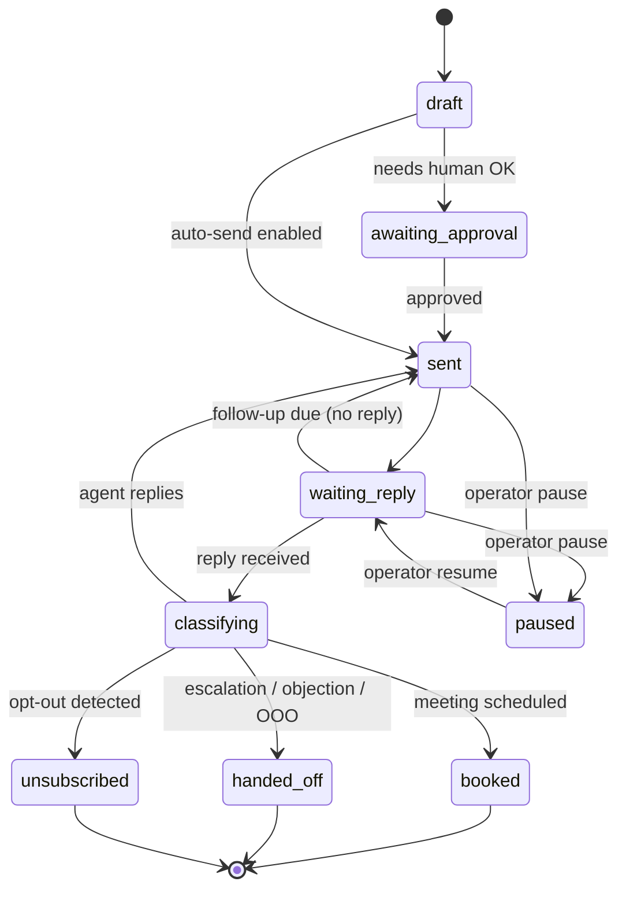

# Leadinfo Outreach Agent — Build Plan

> **Status:** Phase 0 (ingestion) complete. Phases 1–8 pending.
> **Operator (agency):** Sichtbarkeitsmeister — runs the system, owns the sending domain `sichtbarkeitsmeister.de`.
> **First tenant org:** Roggendorf (the Roggendorf organisation in the dashboard). Multi-tenant from day one.
> **Last updated:** 2026-05-25
>
> **Guiding principle:** Build in-house wherever the work is bounded and the value compounds (job runner, booking, in-app analytics). Pay external providers only where building would mean reinventing infrastructure that depends on data, reputation, or platform access we cannot replicate (email deliverability, contact data, LinkedIn API).

---

## 0. TL;DR — what is this and what do I need to do?

**The product:** Anonymous Leadinfo visit → AI agent finds the right contact → sends a personalised email or LinkedIn message → handles replies → books a meeting → hands off to a human. Multi-tenant; resellable.

**Where we are:** Leadinfo data is captured and visible in the dashboard. Nothing acts on it yet.

**What's next (Phase 1 — ~1.5 weeks):**
1. Build an in-house job runner (no Inngest)
2. Turn raw Leadinfo events into typed company / visit / contact records
3. Add a Leads page so you can see real companies, not raw JSON

**Total to a sellable v1:** ~12.5 weeks. Demo-ready at ~8.5 weeks.

### What you (the human) need to do

| Action | When | Where |
|--------|------|-------|
| ✅ **8 decisions answered** (language, channel, approval, booking, ...) | Done | §9 |
| ✅ **Vercel + GitHub** | Already in use — production at `https://www.digital-twin-sbkm.de` (Hobby plan) | §13.1 |
| ✅ **Cron driver decided:** Supabase `pg_cron` (free, works on Hobby) | Done | §3.4 |
| **Trigger one real Leadinfo visit** | Now | Visit your tracked site |
| **Sign up: Apollo** (or alternative) | Before Phase 2 | §13.3 |
| **Sign up: Postmark + verify `sichtbarkeitsmeister.de` DNS** (SPF/DKIM/DMARC) | Before Phase 3 | §13.4 |
| **Sign up: Cal.com** | Before Phase 4 | §13.5 |
| **Sign up: Unipile + dedicated LinkedIn account** | Before Phase 6 | §13.6 |
| Approve drafts, run the agent | After Phase 4 ships | Dashboard |

### What I (the agent) build, in order

```
Phase 1: Jobs runner + Leads
Phase 2: + Apollo enrichment
Phase 3: + Postmark email
Phase 4: + AI drafting + approval queue
Phase 5: + Reply handling + follow-ups + booking detection  ← demo-ready
Phase 6: + LinkedIn (Unipile)
Phase 7: + Operator polish + analytics
Phase 8: + Hardening + production deploy
```

### Cost in production (Vercel + GitHub already paid)

- **Without LinkedIn:** ~$110 / mo + Anthropic usage
- **With LinkedIn:** ~$170 / mo + Anthropic usage

Detailed breakdown in §13.

### What we build vs buy

🏠 **Build:** jobs runner, dashboards, agent rules, suppression list, analytics, audit log, eventually booking
☁️ **Buy:** Supabase, n8n (transport from Leadinfo), Anthropic, Apollo (data), Postmark (email reputation), Unipile (LinkedIn), Vercel (hosting)

Why this split: details in §2.1.

---

## 1. Vision

Turn anonymous Leadinfo company visits into booked appointments without manual prospecting.

A single org-scoped pipeline:

1. **Capture** — Leadinfo visit lands as a webhook event.
2. **Normalize** — Event becomes a typed company + visit + contact record.
3. **Enrich** — Apollo fills missing emails, titles, LinkedIn URLs.
4. **Decide** — AI picks the best contact and the best channel.
5. **Outreach** — Email (Postmark) or LinkedIn (Unipile) message goes out.
6. **Converse** — AI agent handles replies, follow-ups, objection handling, scheduling.
7. **Hand off** — Once a meeting is booked or escalation is needed, a human takes over.
8. **Control** — Operator can pause per company, switch channels, edit tone, take over a thread at any time.

The end product is **resellable to other agencies/orgs**: each tenant brings its own Leadinfo, Postmark, Unipile, Apollo credentials, sets its own tone/rules, and runs in isolation.

---

## 2. Stack & responsibilities

Legend: 🏠 in-house code we own, ☁️ external service we depend on, 📦 open-source library we install.

| Tool | Type | Role | Why this choice |
|------|------|------|-----------------|
| **Next.js 16 + Supabase** | ☁️ | App, auth, RLS, source of truth | Already in place |
| **n8n Cloud** | ☁️ | Leadinfo → our webhook bridge (transport only) | Leadinfo's supported integration target. We keep it as a thin transport so it can also be used for other lightweight inbound automations (Slack alerts, simple flows) without writing custom integrations |
| **Jobs runner** | 🏠 | Durable async workflows: normalize, enrich, send, retry, schedule follow-ups, throttle | Built on Postgres `jobs` table + Supabase `pg_cron` (drives a Next.js `/api/jobs/run` worker via `pg_net`). Replaces Inngest. Keeps state in our DB, no per-execution fees, works on Vercel Hobby |
| **Vercel AI SDK** | 📦 | Tool-calling, structured outputs, streaming | Open-source TS lib; thinner than writing tool-call orchestration ourselves |
| **Anthropic Claude** | ☁️ | LLM | Existing key, already used by survey AI |
| **Apollo.io** | ☁️ | Contact enrichment by domain | Reproducing this means scraping the web. Pluggable: Hunter.io / Snov.io / Dropcontact |
| **Postmark** | ☁️ | Transactional email + inbound parse | Email deliverability needs IP reputation we can't build quickly. Pluggable: Resend, AWS SES |
| **Unipile** | ☁️ | LinkedIn messaging API | Safe LinkedIn automation. Building it means account bans + ToS issues |
| **Booking flow** | 🏠 (v2) / ☁️ Cal.com (v1) | Meeting scheduling | v1: paste Cal.com or Calendly link. v2: native using Google / Microsoft calendar OAuth |
| **Vercel** | ☁️ | Hosting (Hobby plan) | Production at `https://www.digital-twin-sbkm.de`. Cron lives in Supabase, not here |
| **Analytics & audit** | 🏠 | Per-org reporting, funnel, cost tracking | All data is in our DB; no third-party BI value-add |
| **Error tracking** | 🏠 first, ☁️ Sentry later | Catch and surface failures | Start with structured logs in Supabase; add Sentry once traffic warrants |

**n8n role clarified:** n8n handles *only* Leadinfo → our webhook (and possibly future inbound bridges). All AI, outreach, scheduling, tenancy, and state live in our app, never in n8n.

### 2.1 Build vs buy — explicit decisions

| We build (🏠) | We pay for (☁️) | Reason |
|---|---|---|
| Jobs runner (queue + scheduler + worker + admin UI) | — | Bounded ~3 dev-days, full control, no usage fees |
| Outreach inbox & thread state machine | — | Core product surface |
| Playbook / agent rules engine | — | Differentiator |
| Suppression list & DNC enforcement | — | Compliance-critical, must be in code |
| Audit log & operator-action log | — | Already in schema |
| Analytics dashboard | — | All data is ours |
| Booking flow (v2) | Cal.com link (v1) | Build only when booking UX is a differentiator |
| Webhook ingestion endpoints | — | Already done (Phase 0) |
| — | Email send/receive (Postmark/Resend) | IP reputation takes years to build |
| — | Contact enrichment (Apollo) | Data moat; scraping at scale is impractical |
| — | LinkedIn API (Unipile) | Reverse-engineering = account bans |
| — | LLM (Anthropic) | Obvious |
| — | n8n transport from Leadinfo | Leadinfo's native target |

---

## 3. Architecture

### 3.1 Data flow



### 3.2 State machine — per outreach thread



### 3.3 Multi-tenancy & isolation

- Every domain table has `organisation_id` and RLS:
  - Members read; admins/owners write.
  - Service role only for inbound webhooks and the jobs worker.
- Per-org credentials live in `org_integrations.secrets` (jsonb).
- Per-org agent rules in `org_integrations.config`. Includes:
  - `language` (locked to `de` in v1)
  - `approval_mode` default (`first_message_only`)
  - `repeat_visit_policy` (`reuse_open_then_new` | `always_new` | `notify_only`; default = `reuse_open_then_new`)
  - `dormant_days` (default 90)
  - `sender_domain` (e.g. `sichtbarkeitsmeister.de`)
  - `cal_com_url`
  - `icp_filters` (structured) + `icp_notes` (free-text)
  - `daily_caps` (informational; LinkedIn cap of 20/account/day is hard-coded in code, not config)
- One worker codebase; `organisation_id` is part of every job payload and is enforced at every query.

### 3.4 Jobs runner — design

- **Queue:** `jobs` table (see §4.1). Status: `pending`, `running`, `succeeded`, `failed`, `dead`.
- **Trigger:** Supabase `pg_cron` runs every 30 s and uses `pg_net` to POST to `/api/jobs/run` on production. The route is protected by `JOBS_WORKER_TOKEN`. (Free; works on Vercel Hobby. Upgrade to Vercel Cron later if we ever leave Supabase.)
- **Worker:** `/api/jobs/run` pulls up to N rows with `FOR UPDATE SKIP LOCKED`, executes the handler matched by `kind`, writes result, retries on failure with exponential backoff, sends to dead-letter after `max_attempts`.
- **Job kinds:** `leadinfo.normalize`, `apollo.enrich`, `outreach.draft`, `outreach.send`, `outreach.classify_reply`, `outreach.plan_next`, `outreach.followup_due`.
- **Idempotency:** every job has a `dedupe_key`; duplicates with the same key in `pending`/`running` are skipped.
- **Admin UI:** under `/dashboard/admin/jobs` — list, filter, retry, kill, view payload + last_error.
- **Concurrency:** per-kind concurrency cap stored in config; Postmark/Unipile sends are throttled this way.

---

## 4. Schema (target end-state)

Existing in Phase 0:
- `org_integrations` — per-org provider credentials + status + webhook token.
- `integration_raw_events` — every inbound payload, never mutated.

### 4.1 New tables (Phase 1+)

```sql
-- Companies identified by Leadinfo
companies (
  id uuid pk,
  organisation_id uuid not null,
  domain text not null,
  name text,
  industry text,
  size_range text,
  country text,
  region text,
  agent_status text check (in ('active','paused','handed_off','blocked')) default 'active',
  channel_preference text check (in ('email','linkedin','any')) default 'any',
  approval_mode_override text check (in ('always','first_message_only','never')),  -- nullable, falls back to org default
  first_seen_at timestamptz not null,
  last_seen_at timestamptz not null,
  metadata jsonb default '{}',
  unique (organisation_id, domain)
)

-- Each Leadinfo visit
visits (
  id uuid pk,
  organisation_id uuid not null,
  company_id uuid references companies,
  raw_event_id uuid references integration_raw_events,
  visited_at timestamptz not null,
  pages jsonb default '[]',  -- [{url, title, duration_s}]
  duration_s integer,
  source text,               -- referrer / campaign
  metadata jsonb default '{}'
)

-- Contacts at companies
contacts (
  id uuid pk,
  organisation_id uuid not null,
  company_id uuid not null references companies,
  source text check (in ('leadinfo','apollo','manual')),
  full_name text,
  first_name text,
  last_name text,
  title text,
  seniority text,
  email text,
  email_verified boolean default false,
  linkedin_url text,
  phone text,
  score integer,             -- AI-assigned fit score 0-100
  do_not_contact boolean default false,
  metadata jsonb default '{}',
  unique (organisation_id, company_id, email)
)

-- One thread = one (company, primary contact, channel) pair
outreach_threads (
  id uuid pk,
  organisation_id uuid not null,
  company_id uuid not null,
  contact_id uuid not null,
  channel text check (in ('email','linkedin')),
  status text check (in ('draft','awaiting_approval','sent','waiting_reply','classifying','paused','booked','handed_off','unsubscribed','failed')),
  current_step integer default 0,
  next_action_at timestamptz,
  goal text default 'book_meeting',
  assigned_user_id uuid,         -- when handed off
  metadata jsonb default '{}',
  created_at timestamptz default now(),
  updated_at timestamptz default now()
)

-- Every message in/out
outreach_messages (
  id uuid pk,
  organisation_id uuid not null,
  thread_id uuid not null references outreach_threads,
  direction text check (in ('outbound','inbound')),
  channel text check (in ('email','linkedin')),
  subject text,
  body_text text,
  body_html text,
  provider_id text,           -- Postmark MessageID / Unipile id
  status text check (in ('drafted','queued','sent','delivered','bounced','replied','failed','opened','clicked')),
  sent_at timestamptz,
  delivered_at timestamptz,
  opened_at timestamptz,
  ai_metadata jsonb default '{}',  -- model, prompt hash, classification result
  created_at timestamptz default now()
)

-- AI step audit (one row per LLM call)
agent_runs (
  id uuid pk,
  organisation_id uuid not null,
  thread_id uuid,
  step text,                  -- 'pick_contact' | 'draft' | 'classify' | 'plan_next' ...
  model text,
  input jsonb,
  output jsonb,
  tokens_in integer,
  tokens_out integer,
  cost_usd numeric(10,4),
  latency_ms integer,
  error text,
  created_at timestamptz default now()
)

-- Operator audit log
operator_actions (
  id uuid pk,
  organisation_id uuid not null,
  user_id uuid not null,
  thread_id uuid,
  company_id uuid,
  action text,                -- 'pause','resume','takeover','edit_message','approve','reject','rotate_token'
  payload jsonb,
  created_at timestamptz default now()
)

-- Suppression list (per org)
suppressions (
  id uuid pk,
  organisation_id uuid not null,
  kind text check (in ('email','domain','linkedin')),
  value text not null,
  reason text,
  created_by uuid,
  created_at timestamptz default now(),
  unique (organisation_id, kind, value)
)

-- In-house jobs runner
jobs (
  id uuid pk,
  organisation_id uuid,                                    -- nullable for system jobs
  kind text not null,                                      -- 'leadinfo.normalize' | 'apollo.enrich' | ...
  status text not null check (in ('pending','running','succeeded','failed','dead')) default 'pending',
  payload jsonb not null default '{}',
  dedupe_key text,                                         -- unique (kind, dedupe_key) where status in pending|running
  run_after timestamptz not null default now(),            -- scheduled execution time
  attempts integer not null default 0,
  max_attempts integer not null default 5,
  last_error text,
  result jsonb,
  locked_at timestamptz,
  locked_by text,                                          -- worker id
  started_at timestamptz,
  completed_at timestamptz,
  created_at timestamptz not null default now(),
  updated_at timestamptz not null default now()
)
-- Index: (status, run_after) for worker pull
-- Partial unique: (kind, dedupe_key) where status in ('pending','running')
```

All tables: RLS, `updated_at` trigger where mutable, indexes on `organisation_id`, FK targets, and `next_action_at` / `run_after` for worker queries.

---

## 5. Phased delivery

Each phase ships independently with its own demo on Roggendorf.

### Phase 0 — Ingestion (DONE)
- ✅ `org_integrations`, `integration_raw_events`
- ✅ Webhook route with token-based org match
- ✅ Dashboard inspector + token rotate / enable / disable
- ✅ n8n bridge from Leadinfo

### Phase 1 — Normalization + jobs runner (next)
**Scope**
- Capture one real Leadinfo payload via n8n
- Migration: `companies`, `visits`, `contacts` (Leadinfo source only)
- Migration: `jobs` table + indexes
- Build jobs runner: `/api/jobs/run` worker, Vercel Cron config, handler registry, retry/backoff logic, dead-letter handling
- Job kind `leadinfo.normalize`:
  - Enqueued from webhook after raw insert
  - Parse → upsert company / visit / contacts(source=leadinfo)
  - Mark `integration_raw_events.processed_at`
- Dashboard:
  - Companies list (search, filter by status, sort by last_seen)
  - Company detail page: visits timeline, contacts table, raw events linked
  - `/dashboard/admin/jobs` minimal admin (list, retry, kill)

**Exit criteria**
A real Leadinfo visit appears as a typed company row within seconds; jobs admin shows succeeded run.

### Phase 2 — Apollo enrichment
**Scope**
- Per-org Apollo credentials in `org_integrations` (provider='apollo')
- Job kind `apollo.enrich`
  - On new company, look up by domain
  - Upsert contacts(source='apollo')
  - Score contacts (AI step: title/seniority match against org's ICP)
- UI: contact list with source badges, score column, "re-enrich" button

**Exit criteria**
New company auto-populated with ranked contacts.

### Phase 3 — Email channel (Postmark)
**Scope**
- Postmark sending domain config UI per org
- Postmark server token in `org_integrations.secrets`
- Job kind `outreach.send` (channel=email)
- Inbound: `/api/integrations/postmark/inbound` (Postmark webhook → match by `Reply-To` / `In-Reply-To` → enqueue `outreach.classify_reply`)
- DKIM/SPF setup checklist in UI
- Suppression on bounce / unsubscribe

**Exit criteria**
Manually approved outbound email sent; reply lands in the same thread.

### Phase 4 — Agent decide & draft
**Scope**
- AI SDK setup with Anthropic provider
- Tool-calling agent steps:
  - `pick_primary_contact(company_id) → contact_id`
  - `draft_initial_message(thread, channel, org_rules) → {subject, body}`
- Per-org **playbook config**: language (de), tone, signature, CTA (Cal.com link), max follow-ups, send window, ICP (structured filters + free-text)
- Approval queue UI (drafts → approve / edit / reject)
- **Approval mode:** org default = `first_message_only`; per-company override allowed (`always` | `first_message_only` | `never`)

**Exit criteria**
Draft generated automatically using org rules; operator approves; email sends.

### Phase 5 — Reply loop
**Scope**
- AI step `classify_reply(thread, message) → {intent, sentiment, next_action}`
  - intents: `interested`, `objection`, `not_now`, `wrong_person`, `unsubscribe`, `ooo`, `booking_request`, `booked`
- AI step `plan_next_step(thread)` → write `outreach_threads.next_action_at`
- Scheduled job kind `outreach.followup_due`:
  - cron job scans threads where `next_action_at <= now()` and enqueues per-thread send jobs
- Booking detection → `booked` status, notify assigned user
- Unsubscribe detection → suppression entry + thread closed

**Exit criteria**
End-to-end test on a sandbox thread: 1st email → reply → AI follow-up → "booked" → handoff.

### Phase 6 — LinkedIn channel (Unipile)
**Scope**
- Unipile account linking UI
- Same send/receive abstraction as email (`outreach.send` with channel=linkedin)
- Channel selector per company (auto-pick or operator override)
- **Hard-coded safety cap: 20 LinkedIn sends/day per linked account**, enforced in code, not configurable. Protects accounts from LinkedIn bans
- Per-kind concurrency cap + per-account daily counter in the jobs runner

**Exit criteria**
Same loop runs on LinkedIn for a contact without an email; safety cap proven in tests.

### Phase 7 — Operator UI & polish
**Scope**
- Outreach inbox: threads grouped by company, status filters, unread counter
- Takeover mode: pauses agent, operator types replies inline
- Pause / resume per company
- Bulk actions: pause selected, mark do-not-contact
- Per-org reporting: sent / replied / booked, by week
- Cost tracking dashboard from `agent_runs.cost_usd`

**Exit criteria**
Non-developer operator at Roggendorf runs the system day-to-day without engineering support.

### Phase 8 — Hardening
- Vercel deployment with stable URL (replace tunnel; n8n forwards to production)
- Structured logs in Supabase + optional Sentry; alerts on webhook 5xx and dead-letter jobs
- Backup + retention policies on raw events (e.g. delete `integration_raw_events` body_raw after 90 days)
- Penetration check on webhook (token entropy, rate-limit, body size cap, signature verification when Leadinfo offers it)
- DPA / privacy review (GDPR, German tenant)

---

## 6. Dashboard — feature inventory

The dashboard is the operator's daily tool. Below is the full target IA. Each item is tagged with the phase it ships in: **[P0]** = already done, **[P1]–[P8]** = future phases.

### 6.1 Top-level navigation

| Section | Route | Audience | Phase |
|---------|-------|----------|-------|
| Dashboard (home) | `/dashboard` | All members | exists |
| Inbox (invites) | `/dashboard/inbox` | All | exists |
| Surveys | `/dashboard/surveys` | All | exists |
| **Leads** | `/dashboard/leads` | Members | **P1** |
| **Outreach** | `/dashboard/outreach` | Members | **P3** |
| **Analytics** | `/dashboard/analytics` | Admins | **P7** |
| Members | `/dashboard/members` | Admins | exists |
| Integrations | `/dashboard/integrations` | Admins | exists |
| Admin (platform) | `/dashboard/admin` | Platform admin | exists |

> Rename consideration: "Integrations" stays as the credential/setup home; "Leads" + "Outreach" hold the day-to-day work.

### 6.2 Leads section (Phase 1+)

#### `/dashboard/leads` — Companies list **[P1]**
- Columns: Company name, domain, last visit, # visits, top contact, agent status, channel, score
- Filters: status, channel, has-contact, source, score range, date range
- Sort: last_seen, score, name
- Search: domain or company name
- Bulk actions (P3+): pause, mark DNC, change channel, assign to user
- Row click → company detail
- Empty state: "Send a Leadinfo test event to verify integration"
- KPI tiles at top: Active companies / Paused / Handed off / Booked this week

#### `/dashboard/leads/[companyId]` — Company detail **[P1]**
Tabs:
1. **Overview**
   - Company facts (domain, industry, size, country, last visit)
   - Agent status with pause/resume + reason field
   - Channel preference toggle
   - Activity feed (visits + outreach messages, merged timeline)
2. **Contacts** (P2)
   - Table with source badges, role, email, LinkedIn, score
   - Set primary contact
   - "Re-enrich" button (manual trigger)
   - Add manual contact
3. **Threads** (P3)
   - List of outreach threads, status pills, last message preview
4. **Visits** (P1)
   - Timeline of visits with pages, duration, referrer
5. **Raw events** (P0, exists, link from here)
6. **Notes** (P7) — internal operator notes per company

#### `/dashboard/leads/import` (P7, optional)
Upload CSV of domains for batch enrichment.

### 6.3 Outreach section (Phase 3+)

#### `/dashboard/outreach` — Inbox **[P3]**
Three-pane layout (mail-client style):
- **Left:** thread list grouped by status (Awaiting approval / Active / Waiting reply / Booked / Handed off)
- **Middle:** selected thread, full message history with direction, channel, status, AI metadata badge
- **Right:** company/contact context panel + actions

Actions in thread view:
- Approve / edit draft
- Take over (pause agent, type reply)
- Pause company
- Hand off to user (assign)
- Mark as booked / unsubscribed manually
- Snooze (P7)
- Add internal note

Filters: channel, status, assigned-to-me, has-unread.

#### `/dashboard/outreach/approvals` **[P4]**
Dedicated queue for drafts requiring approval. Bulk approve / reject.

#### `/dashboard/outreach/templates` **[P4]**
Per-org reusable snippets / opener variants. AI uses these as examples.

#### `/dashboard/outreach/playbook` **[P4]**
Per-org agent rules:
- Language (de/en)
- Tone presets + free-text rules
- Signature block per channel
- Max follow-ups, follow-up cadence
- Send window (timezone, business hours)
- Goal types and CTA links (Cal.com URL)
- Channel priority (email-first / linkedin-first / mixed)
- Approval mode (`always` / `first_message_only` / `never`)

### 6.4 Analytics section (Phase 7)

#### `/dashboard/analytics` **[P7]**
- Funnel: Visits → Companies → Contacts → Messages sent → Replies → Booked
- Conversion rates per stage, per channel
- Top-performing message variants
- Cost: tokens + $/booked-meeting
- Per-week trend lines

### 6.5 Integrations section (extend)

Existing: Leadinfo. Add provider cards as features ship.

| Provider | Fields | Phase |
|----------|--------|-------|
| Leadinfo | webhook URL (existing) | P0 |
| Apollo | API key, ICP filters | P2 |
| Postmark | server token, from address, reply-to, sending domain checks (DKIM/SPF status) | P3 |
| Unipile | account link, status, daily send cap | P6 |
| Cal.com | booking link per user/org | P4 |

Each card: status pill (Connected / Needs setup / Error), test-connection button, last event timestamp.

### 6.6 Settings & permissions

#### `/dashboard/settings/agent` **[P4]**
Same fields as Playbook above, but org-wide vs per-campaign distinction (P7).

#### `/dashboard/settings/notifications` **[P5]**
Email digest cadence, per-event preferences (booked, error, daily summary).

#### `/dashboard/members` (exists)
Add role: **Operator** (read threads, approve, takeover, no admin).

### 6.7 Cross-cutting dashboard features

- **Org switcher** (exists) — keep prominent; every page is org-scoped.
- **Global search** (P5) — Cmd-K palette: companies, contacts, threads, raw events.
- **Activity feed** (P5) — per-org event stream (sent / replied / booked / paused).
- **Notification dot** on sidebar items (Awaiting approval, New replies, Errors).
- **Empty-state coaching** — every list page links to next setup step.
- **Timezone-aware timestamps** — show org TZ + relative time.
- **Dark mode** — already in design system.
- **Audit log viewer** (P7) — `operator_actions` and `agent_runs` browsable, exportable.
- **Jobs admin** (P1) — `/dashboard/admin/jobs` — list, filter by kind/status, retry, kill, view payload + last_error.
- **Health page** (P8) — `/dashboard/admin/health` — webhook ingest rate, jobs backlog (pending count, oldest pending age), provider error rate, last-sync per integration.

### 6.8 Suggested extras worth considering

- **AI explainability panel** on each draft: "Why this contact / why this opener" with cited fields.
- **Tone preview**: org admin pastes a sample input, sees AI output for current playbook.
- **Diff viewer** when an operator edits an AI draft — used as fine-tuning signal later.
- **A/B variants** on opener (P7) — track which variant books more.
- **Per-company kill switch via email**: replying STOP to internal notification pauses the company instantly.
- **Slack / Teams notifications** (P7) — booked, error, awaiting-approval count.
- **Public read-only share link** for a thread (P8, optional) — for client transparency.
- **Customer-facing white-label settings** (P8) — when reselling: logo, sender name, support email.

---

## 7. AI prompt & tool design (high level)

### Tools exposed to the agent (Vercel AI SDK)
- `getCompanyContext(company_id)` — facts + recent visits + ICP fit notes
- `getContactCandidates(company_id)` — ranked contact list
- `getOrgPlaybook()` — language, tone, signature, CTA links, examples
- `getThreadHistory(thread_id)` — last N messages
- `searchSuppressions(value)`
- `proposeOutboundMessage({thread_id, subject, body})` — writes draft, awaits approval
- `classifyReply({thread_id, message_id})` — returns structured intent
- `scheduleFollowUp({thread_id, in_hours})`
- `markBooked({thread_id, evidence})`
- `escalateToHuman({thread_id, reason})`

### Determinism guards
- Hard-coded suppression / DNC checks **outside** the LLM before any send.
- Send-window check **outside** the LLM.
- Every `proposeOutboundMessage` runs through a regex/validator (no unsubscribe broken, no missing CTA, length limits).

### Cost control
- Track per-step tokens in `agent_runs`.
- Daily org budget cap; soft-stop sends past cap.

---

## 8. Security, privacy, compliance

- **GDPR**: companies/contacts hold personal data. Add `data_subject_request` flow (P8).
- **Right to be forgotten**: `delete_contact_cascade()` SQL function.
- **Suppression lookup is mandatory** before every send, in code (not in prompt).
- **Webhook hardening**:
  - Token rotation (exists)
  - Body size cap (exists, truncate to 256 KB)
  - Rate limiting per token (P3)
  - Optional HMAC signature verification when Leadinfo / Postmark / Unipile sign payloads
- **Secrets**: `org_integrations.secrets` jsonb is service-role only. Consider Supabase Vault wrapper (P8).
- **Audit trail**: every operator action and agent send is logged.

---

## 9. Decisions (locked in 2026-05-25)

| # | Question | Decision |
|---|----------|----------|
| 1 | Outreach language | **German only** (no per-thread override in v1) |
| 2 | First channel | **Email first** (Phase 3); LinkedIn after (Phase 6) |
| 3 | Approval mode | **Per-company toggle** — operator decides per company. Org default = `first_message_only`; each company can override (`always` / `first_message_only` / `never`) |
| 4 | Booking method | **Cal.com link in CTA**; AI never proposes specific times in v1 |
| 5 | Repeat-visit handling | **Configurable per org**; default = reuse open thread, start a new one after 90 days dormant |
| 6 | ICP definition | **Both** — structured filters (industry, size, country, role) **and** free-text guidance per org |
| 7 | Sender identity | **`sichtbarkeitsmeister.de`** (agency-owned domain) for the first tenant. Each future tenant configures its own sending domain via `org_integrations.config.sender_domain` for resale |
| 8 | Daily caps | **No app-side cap in v1**; rely on provider rate limits. **Exception:** LinkedIn has a hard-coded safety cap of **20 sends/day per linked account** to protect against bans. Cannot be disabled by operator config |
| 9 | Reseller billing | Out of scope for v1; track usage now via `agent_runs.cost_usd` |
| 10 | Survey linkage | Out of scope; surveys remain a separate product |

---

## 10. Milestones & rough timeline

Estimates assume 1 engineer focused, calendar weeks.

| Phase | Scope | Effort |
|-------|-------|--------|
| 1 | Jobs runner + Leadinfo normalization (companies/visits/contacts) + Leads UI + jobs admin | 1.5 wks |
| 2 | Apollo enrichment + scoring | 1 wk |
| 3 | Postmark send/receive + thread model + Outreach inbox skeleton | 2 wks |
| 4 | AI draft + playbook + approval queue | 2 wks |
| 5 | Reply loop + follow-ups + booking detection | 2 wks |
| 6 | Unipile LinkedIn channel | 1.5 wks |
| 7 | Operator UI polish + analytics + audit log | 1.5 wks |
| 8 | Hardening + Vercel deploy + GDPR + observability | 1 wk |

**Total:** ~12.5 weeks to a sellable v1.

A useful demo to Roggendorf is reachable end of Phase 5 (~8.5 weeks).

---

## 11. Immediate next actions

1. Trigger one **real Leadinfo visit** through the n8n bridge so we have a true payload shape.
2. Inspect it in `/dashboard/integrations/leadinfo/events`.
3. Open a Phase 1 branch and implement:
   - Migration `20260526_jobs_runner.sql` (`jobs` table + indexes)
   - Migration `20260526_leadinfo_normalized_tables.sql` (`companies`, `visits`, `contacts`)
   - Build `/api/jobs/run` worker (token-protected), register `leadinfo.normalize` handler
   - Enable `pg_cron` + `pg_net` extensions in Supabase; schedule a 30 s job that POSTs to `/api/jobs/run`
   - Enqueue normalization job from the webhook route after raw insert
   - Build `/dashboard/leads` + `/dashboard/leads/[companyId]`
   - Build minimal `/dashboard/admin/jobs`
4. Decide on the 10 open questions in §9.
5. Sign up for accounts per §13 in parallel so later phases are not blocked on KYC/DNS.

---

## 12. Glossary

- **Thread** — one ongoing outreach conversation with one contact on one channel.
- **Playbook** — the per-org config (tone, rules, cadence, signature) the agent obeys.
- **ICP** — Ideal Customer Profile; structured filters + free-text guidance.
- **Handoff** — agent stops, human user becomes responsible for the thread.
- **Pause** — temporary stop on outbound for a company or thread.
- **Suppression** — global do-not-contact list per org.
- **DNC** — Do Not Contact (per-contact flag).
- **Jobs runner** — our in-house background-job system (Postgres `jobs` table + Vercel Cron + worker route).
- **Dead-letter** — a job that exhausted its retries; sits in `status='dead'` for manual inspection.

---

## 13. Accounts & costs

What you need to sign up for, in the order you'll actually need each one. Prices are list prices as of mid-2026 and may change — check the link before committing.

### 13.1 Already have

| Service | Plan | Cost | Notes |
|---------|------|------|-------|
| **Supabase** | Pro recommended for production | $25 / project / mo | Free tier is fine for dev. Pro adds daily backups, no auto-pause |
| **Anthropic** | Pay as you go | ~$3–15 / 1M input tokens depending on model | Track per-org usage in `agent_runs.cost_usd` |
| **n8n Cloud** | Starter | ~€20 / mo | Already paying via Sichtbarkeitsmeister workflow |
| **Vercel** | **Hobby** | Free | Production domain: `https://www.digital-twin-sbkm.de`. Hobby cron is daily only → we drive the jobs runner from Supabase `pg_cron` instead (see §3.4) |
| **GitHub** | Source + Vercel deploy | Existing | — |
| **Cloudflare** | Free quick tunnels (dev only) | Free | Used for local dev forwarding. n8n keeps using the tunnel during dev; switch to `www.digital-twin-sbkm.de` once Phase 1 is deployed to production |

**No new vendor needed for Phase 1 infrastructure.** Jobs runner = Supabase `jobs` table + Vercel Cron + a Next.js worker route. Zero extra signups.

### 13.2 Production URL & cron — confirmed

- **Production app URL:** `https://www.digital-twin-sbkm.de`
- **Cron driver:** Supabase `pg_cron` calling `/api/jobs/run` via `pg_net` HTTP every 30 s (no Vercel Pro upgrade needed)
- **n8n forwarding:** keep tunnel for dev; switch to `https://www.digital-twin-sbkm.de/api/integrations/leadinfo/webhook/{token}` when Phase 1 is deployed

### 13.3 Sign up before Phase 2 (enrichment)

| Service | Why | Plan to start | Cost | Sign-up link |
|---------|-----|--------------|------|--------------|
| **Apollo.io** | Contact enrichment by domain | Free → Basic | Free tier ~50 credits/mo; Basic ~$49 / user / mo | https://www.apollo.io |

Alternatives if Apollo doesn't fit: Hunter.io (~$34/mo), Snov.io (~$39/mo), Dropcontact (€24/mo, GDPR-friendly, good for German/EU contacts).

### 13.4 Sign up before Phase 3 (email)

| Service | Why | Plan to start | Cost | Sign-up link |
|---------|-----|--------------|------|--------------|
| **Postmark** | Send + receive transactional email | Developer tier (free 100 sends), then Starter | Free for dev; $15 / mo for 10k sends | https://postmarkapp.com |
| **Domain DNS** | SPF / DKIM / DMARC records for your sending domain | — | Free if you already own the domain | Configure at your registrar |

Alternative: **Resend** (https://resend.com) — $0 free tier (3k/mo), $20 / mo for 50k. Simpler API, designed for Next.js. Inbound parse is newer than Postmark's but improving. Pick one.

You'll also need:
- **A real sending domain** (e.g. `mail.roggendorf.de`) you control
- **A from-address mailbox** that can receive bounces

### 13.5 Sign up before Phase 4 (booking CTAs)

| Service | Why | Plan to start | Cost | Sign-up link |
|---------|-----|--------------|------|--------------|
| **Cal.com** (cloud) or self-host | Booking link in CTAs | Free tier; Teams $12 / user / mo | https://cal.com |
| **Calendly** (alternative) | Same | Free; Standard $10 / user / mo | https://calendly.com |

Either works for v1. We'll build a native booking flow only when it becomes a differentiator.

### 13.6 Sign up before Phase 6 (LinkedIn)

| Service | Why | Plan to start | Cost | Sign-up link |
|---------|-----|--------------|------|--------------|
| **Unipile** | LinkedIn send/receive API | Per-account pricing | ~$59 / linked account / mo | https://www.unipile.com |
| **A LinkedIn account** | The actual account that messages will be sent from | — | Existing personal account or a "sales rep" account per org | — |

LinkedIn rate-limits aggressively. Plan for ~10–20 connection requests / day per account.

### 13.7 Optional / later

| Service | Why | Plan | Cost | Sign-up link |
|---------|-----|------|------|--------------|
| **Sentry** | Error tracking once on production traffic | Developer (free 5k events) | Free, then $26 / mo | https://sentry.io |
| **PostHog** | Product analytics (operator usage) | Free tier 1M events | Free, then usage-based | https://posthog.com |
| **Slack incoming webhook** | Booked / error notifications | Free with any Slack workspace | Free | https://api.slack.com |

### 13.8 Approximate monthly cost — first paying customer

| Tier | Services | Cost / mo |
|------|----------|-----------|
| **Dev only** | Supabase Free + Vercel Hobby + n8n Cloud + Anthropic pay-go | ~€20 + Anthropic usage |
| **Production v1 (1 customer)** | Supabase Pro $25 + Vercel (existing) + n8n Starter €20 + Postmark $15 + Apollo Basic $49 + Cal.com free + Anthropic | **~$110 / mo + Anthropic** before Unipile |
| **Production v1 with LinkedIn** | Above + Unipile $59 / account | **~$170 / mo + Anthropic** |
| **Per additional reseller customer** | Marginal: Postmark sends + Apollo credits + Unipile account + Anthropic tokens | Highly usage-dependent; aim to keep variable cost < 20 % of customer revenue |

### 13.9 Environment variables you'll need

Add to `.env.local` as each phase ships. Copy template into `.env.example`.

```bash
# Phase 1 (jobs runner)
APP_BASE_URL=                    # public URL of the deployed app
JOBS_WORKER_TOKEN=               # shared secret between cron and /api/jobs/run

# Phase 2
APOLLO_API_KEY=                  # default; per-org overrides go in org_integrations.secrets

# Phase 3
POSTMARK_SERVER_TOKEN=           # default; per-org overrides in org_integrations.secrets
POSTMARK_INBOUND_SECRET=         # for verifying Postmark inbound webhook

# Phase 4
DEFAULT_BOOKING_URL=             # fallback Cal.com / Calendly link

# Phase 6
UNIPILE_API_KEY=
UNIPILE_DSN=                     # account identifier provided by Unipile

# Optional (Phase 7+)
SENTRY_DSN=
SLACK_WEBHOOK_URL=
```
