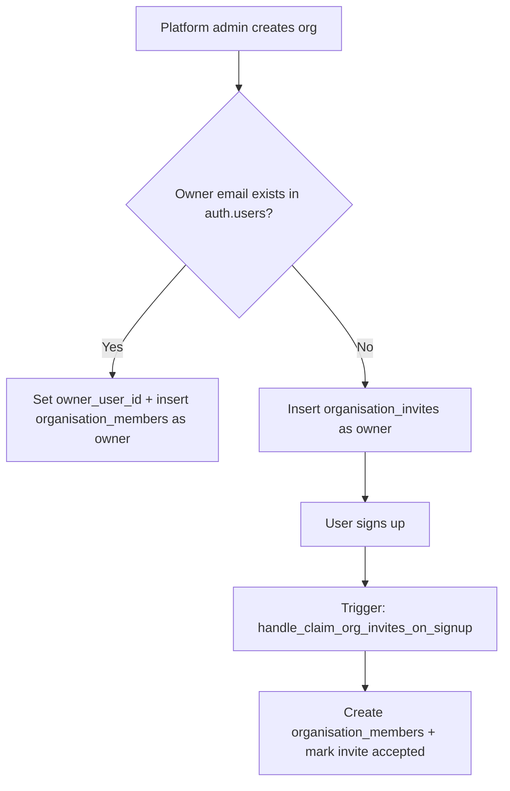
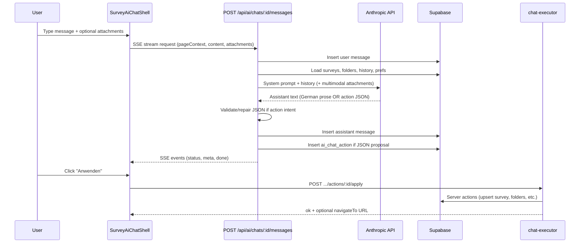

# Organisation Setup & Survey AI Assistant — Context Document

> Generated from the **sbkm** Supabase project (via MCP `list_tables` / `execute_sql`) and the application codebase.  
> Snapshot date: 2026-05-28.

---

## 1. High-level architecture

DigitalTwin is a **Next.js + Supabase** SaaS app with two largely separate tenancy models:

| Domain | Scope | Who can access |
|--------|--------|----------------|
| **Organisations** | Multi-tenant B2B workspace (members, invites, integrations, Leadinfo data) | Platform admins + org members (RBAC) |
| **Surveys** | Platform-admin tool (drafts, publish, responses, AI assistant) | `profiles.role = 'admin'` only (RLS) |
| **Survey AI chats** | Per-user assistant history | Authenticated user owns their own chats |

**Important:** Surveys are **not** linked to `organisations` in the database today. Organisation context drives integrations (Leadinfo), companies/contacts/visits, and member management — not survey ownership.

---

## 2. Authentication & platform roles

### 2.1 `auth.users` (Supabase Auth)

Standard Supabase auth table. All app users live here. Currently **5 users** in sbkm.

### 2.2 `public.profiles`

Extends `auth.users` with app-level identity:

| Column | Purpose |
|--------|---------|
| `id` | PK, FK → `auth.users(id)` |
| `email` | Denormalized email |
| `role` | `'admin'` or `'customer'` (default `'customer'`) |
| `created_at`, `updated_at` | Timestamps |

**Platform admin** = `profiles.role = 'admin'`. Checked everywhere via `public.is_platform_admin(uid)` (SECURITY DEFINER, row_security off to avoid RLS recursion).

**Current sbkm data:** 3 profiles.

RLS highlights:
- Users read/update their own profile.
- Users can view other profiles if they share an organisation (`can_view_profile`).
- Admins have broader visibility.

---

## 3. Organisation model (Phase 2 RBAC)

### 3.1 Enums

```sql
org_role:       'owner' | 'admin' | 'employee'
invite_status:  'pending' | 'accepted' | 'revoked'
```

### 3.2 Core tables

#### `public.organisations`

| Column | Notes |
|--------|-------|
| `id` | UUID PK |
| `name` | Display name |
| `slug` | Optional unique URL slug |
| `owner_user_id` | Nullable — supports “owner invited but not signed up yet” |
| `created_by_user_id` | Platform admin who created the org |
| `archived_at` | Soft archive |
| `created_at`, `updated_at` | Timestamps |

**sbkm live data (2 orgs):**

| Name | Slug | Owner set | Members | Pending invites |
|------|------|-----------|---------|-----------------|
| Roggendorf | `roggendorf` | null | 1 | 0 |
| Sichtbarkeitsmeister | null | set | 1 | 1 |

#### `public.organisation_members`

Composite PK `(organisation_id, user_id)`.

| Column | Notes |
|--------|-------|
| `org_role` | `owner`, `admin`, or `employee` |
| `created_by_user_id` | Who added this member |

Membership writes are **not** done via direct INSERT/UPDATE/DELETE — RLS blocks direct mutations. Changes go through SECURITY DEFINER RPCs.

FK to `profiles(id)` enables PostgREST embedding of member emails (subject to profiles RLS).

#### `public.organisation_invites`

Email-based invites before signup:

| Column | Notes |
|--------|-------|
| `email` | Lowercase enforced by CHECK |
| `org_role` | Role granted on accept |
| `status` | pending / accepted / revoked |
| `invited_by_user_id` | Inviter |
| `accepted_at`, `revoked_at` | Lifecycle |

Unique partial index: one pending invite per `(organisation_id, email)`.

### 3.3 Organisation lifecycle



**Key RPCs** (all SECURITY DEFINER, in `database/schema.sql`):

| RPC | Who can call | Purpose |
|-----|--------------|---------|
| `create_organisation_with_owner(org_name, org_slug, owner_email)` | Platform admin | Create org + owner member or pending owner invite |
| `invite_to_organisation(org_id, email, role)` | Owner, org admin, platform admin | Send invite |
| `accept_organisation_invite(invite_id)` | Invitee (matching JWT email) | Accept pending invite |
| `revoke_organisation_invite(invite_id)` | Owner, org admin, platform admin | Revoke invite |
| `kick_from_organisation(org_id, target_user_id)` | Owner, org admin (rules), platform admin | Remove member |
| `transfer_organisation_ownership(org_id, new_owner_user_id)` | Owner or platform admin | Transfer ownership |
| `set_organisation_member_role(org_id, target_user_id, new_role)` | Owner or platform admin | Change member role |

**Helper functions:**

- `is_org_member(org_id, uid)` — membership check (SECURITY DEFINER)
- `has_pending_org_invite(org_id, email)` — invitee can see org metadata before joining
- `my_org_role(org_id)` — current user's org role
- `can_kick(org_id, target_user_id)` — owner can kick anyone except self; admin can kick employees only

### 3.4 Organisation RLS summary

| Table | SELECT | INSERT | UPDATE | DELETE |
|-------|--------|--------|--------|--------|
| `organisations` | Member, pending invitee, platform admin | Platform admin only | Owner or platform admin | — |
| `organisation_members` | Member or platform admin | Blocked (RPC only) | Blocked | Blocked |
| `organisation_invites` | Member, platform admin, own pending | Blocked | Blocked | Blocked |

### 3.5 Application layer (`lib/dashboard/org-context.ts`)

| Function | Behavior |
|----------|----------|
| `getAuthenticatedUserId()` | Redirect to login if unauthenticated |
| `loadUserOrganisations(userId)` | Join `organisation_members` → `organisations`, sorted by `created_at` desc |
| `resolveSelectedOrganisationId(orgs, orgParam)` | URL `?org=` or default to first org |
| `canManageOrganisation()` | Platform admin OR org role `owner`/`admin` |
| `isMemberOfOrganisation()` | Platform admin OR any membership |
| `userCanManageAnyIntegrations()` | Platform admin OR owner/admin in any org |

**Dashboard routes:**
- `/dashboard/organisations` — user's org list + pending invites inbox
- `/dashboard/organisations/[organisationId]` — org detail
- `/dashboard/admin/organisations` — platform admin org creation
- `/dashboard/members?org=` — member management per org

---

## 4. Organisation-scoped data (integrations & Leadinfo)

These tables hang off `organisations.id`:

### 4.1 `public.org_integrations`

Per-org third-party connections (e.g. Leadinfo webhook).

| Column | Purpose |
|--------|---------|
| `provider` | e.g. `'leadinfo'` |
| `status` | `'enabled'` / `'disabled'` |
| `webhook_token` | Unique inbound token |
| `config`, `secrets` | JSONB configuration |

**sbkm:** 2 rows.

### 4.2 `public.integration_raw_events`

Inbound webhook audit log. Links to org + integration. **8 rows** in sbkm.

### 4.3 `public.jobs`

Background job queue, optionally scoped to `organisation_id`. Status: pending → running → succeeded/failed/dead. **1 row** in sbkm.

### 4.4 Leadinfo normalized CRM tables

| Table | Purpose | sbkm rows |
|-------|---------|-----------|
| `companies` | Domain-level company records per org | 1 |
| `visits` | Website visit events linked to company + raw event | 1 |
| `contacts` | People at companies (Leadinfo/Apollo/manual) | 0 |

Companies carry agent/outreach metadata: `agent_status`, `channel_preference`, `approval_mode_override`.

---

## 5. Survey domain (separate from organisations)

### 5.1 Tables

| Table | Purpose | sbkm rows |
|-------|---------|-----------|
| `surveys` | Survey drafts/definitions (JSONB `definition`), visibility, slug, folder | 46 |
| `survey_folders` | Named folders for grouping surveys | 12 |
| `survey_responses` | Anonymous/participant responses (token-gated public RPCs) | 38 |
| `survey_field_questions` | Per-field Q&A during response (question/remark) | 73 |

**Survey definition schema:** version `1`, steps with fields of types `text`, `radio`, `checkbox`, `rating`, `ranking`. Validated in app via `lib/surveys/schema.ts` (Zod).

**RLS:** All survey tables are **platform-admin-only** for direct table access. Public respondents use SECURITY DEFINER RPCs with token validation.

### 5.2 Survey ownership model

- `surveys.created_by_user_id` tracks creator.
- No `organisation_id` column.
- AI assistant and dashboard survey actions run as the logged-in platform admin.

---

## 6. Survey AI assistant — overview

The Survey KI is a **proposal-based copilot**: the model never writes directly to the database. It returns structured JSON **proposals** that the user must **apply**, **reject**, or **revert**.

Two API surfaces exist:

| API | Status | Access |
|-----|--------|--------|
| **Global chat** (`/api/ai/chats/...`) | Primary UI | Any authenticated user (typically platform admin in practice) |
| **Legacy single-shot** (`POST /api/ai/surveys`) | Older | Platform admin only |

The floating **KI-Assistent** widget (`SurveyAiAssistant`) wraps a full multi-chat shell.

---

## 7. Survey AI — database persistence

### 7.1 Tables

| Table | Purpose | sbkm rows |
|-------|---------|-----------|
| `ai_chats` | Chat sessions per user (`title`, `archived_at`, `assistant_rules`) | 9 |
| `ai_chat_messages` | User/assistant/system messages + JSON `metadata` | 69 |
| `ai_chat_actions` | Proposals linked to assistant messages | 14 |
| `ai_chat_attachments` | File uploads (Supabase Storage) per message | 0 |
| `survey_ai_user_preferences` | Global user prefs (auto-navigate, archived chats, global rules) | 2 |

**RLS:** All AI chat tables are **user-scoped** — `auth.uid() = ai_chats.user_id` (or EXISTS subquery for child rows).

### 7.2 Action execution states

`ai_chat_actions.execution_status`:

```
proposed → applied | failed
applied  → reverted (via revert_payload)
```

---

## 8. Survey AI — frontend flow



### 8.1 UI components

| File | Role |
|------|------|
| `components/surveys/survey-ai-assistant.tsx` | Floating bot button + panel container |
| `components/surveys/survey-ai-chat-shell.tsx` | Chat list, composer, SSE handling, apply/reject/revert |
| `components/surveys/survey-ai-chat-thread.tsx` | Message rendering, proposal parsing, action trace |
| `components/surveys/survey-ai-action-trace.tsx` | Apply / Reject / Revert buttons + status |
| `components/surveys/survey-ai-chat-list.tsx` | Sidebar chat history |
| `app/settings/survey-ai-settings-card.tsx` | Global prefs + `global_assistant_rules` |

**Page context** sent with every message:

```typescript
{
  page: "survey_list" | "survey_builder_new" | "survey_builder_edit",
  surveyId: string | null,
  visibility?: "private" | "public",
  slug?: string | null,
  notificationEmails?: string[]
}
```

Mounted from `app/dashboard/surveys/_components/surveys-ai-assistant.tsx` on survey list and builder pages.

---

## 9. Survey AI — backend message pipeline

**Entry:** `app/api/ai/chats/[chatId]/messages/route.ts` (POST, SSE stream)

### 9.1 Context assembly

1. Persist user message (+ attachments to Storage bucket `ai-chat-attachments`).
2. Load last **10** messages verbatim for Anthropic history; older messages compressed into `conversationSummary` (max ~2400 chars).
3. Load up to **50** known surveys (ranked by keyword overlap with user message + boost for active survey).
4. Load up to **2** candidate survey contexts with full `definition` only for the survey open in the builder; others get `stepOutline` + `duplicateIdReport`.
5. Load all folders, user global rules (`survey_ai_user_preferences`), per-chat rules (`ai_chats.assistant_rules`).

### 9.2 System prompt structure (`lib/ai/chat-context.ts`)

Three blocks (with optional Anthropic prompt caching on the static block):

1. **Static instructions** (~3k tokens) — German default, chat vs action mode, allowed JSON shapes, survey schema rules, patch vs full-edit policy.
2. **User rules** — global + per-chat custom instructions.
3. **Dynamic context** — page, surveys, folders, candidate contexts, attachments, conversation summary.

### 9.3 Model routing (`lib/ai/survey-model-config.ts`)

Heuristic pre-router picks model tier:

| Tier | Default model | Env override | Max tokens | When |
|------|---------------|--------------|------------|------|
| **chat** | `claude-haiku-4-5-20251001` | `ANTHROPIC_SURVEY_CHAT_MODEL` | 4096 | Questions, brainstorming, explanations |
| **action** | `claude-sonnet-4-6` | `ANTHROPIC_SURVEY_ACTION_MODEL` | 16384 | Create/edit/delete/publish/folder ops |

Detection uses German/English action verbs, builder page context, and whether the last assistant message was action JSON.

Utility models (same as chat tier) handle chat title generation and malformed JSON repair.

### 9.4 Multi-phase survey creation

For large new surveys (≥12 steps or “comprehensive” phrasing), when enabled:

1. **Phase 1 — Outline:** blueprint steps/fields without options/scales.
2. **Phase 2 — Expand:** chunks of 6 steps expanded to full schema.
3. Merge → validate with `surveySchema` → emit `create_survey` proposal JSON.

Implemented in `lib/ai/survey-multiphase-create.ts`. Falls back to single-shot on failure.

### 9.5 Output handling

1. **Continuation:** if `stop_reason === 'max_tokens'`, up to 3 continuation rounds (no separator injection — avoids corrupting JSON).
2. **JSON repair:** utility model repairs malformed action JSON; if still failing, action model regenerates.
3. **Validation:** `surveyAiProposalSchema` (Zod) in `lib/ai/survey-assistant-types.ts`.
4. **Persistence:** assistant message + optional `ai_chat_actions` row with `execution_status: 'proposed'`.

### 9.6 Chat modes

| Mode | Assistant output | Stored as action? |
|------|------------------|-------------------|
| **Chat** | German Markdown prose | No |
| **Action** | Single JSON object (no code fences) | Yes, if valid proposal |

The model is instructed to **never claim changes are applied** — only propose.

---

## 10. Survey AI — proposal types & execution

### 10.1 Proposal kinds (`surveyAiProposalSchema`)

| Kind | Purpose |
|------|---------|
| `create_survey` | New survey with full definition |
| `patch_survey_definition` | **Preferred** for edits — array of operations |
| `edit_survey_definition` | Full survey replacement (only for explicit complete overhauls) |
| `update_survey_metadata` | Title/description |
| `create_folder` / `rename_folder` / `delete_folder` | Folder CRUD |
| `assign_folder` | Link survey to folder (or null to unassign) |
| `publish` / `unpublish` | Visibility |
| `delete_survey` | Soft-delete (archive) |
| `batch` | Ordered multi-step workflow with `ref` identifiers |

**Patch operations:** `update_field`, `add_field`, `delete_field`, `update_step`, `add_step`, `delete_step`/`remove_step`, `update_survey_root`, `update_info_text`.

### 10.2 Executor (`lib/ai/chat-executor.ts`)

`applySurveyProposal()` delegates to existing server actions in `app/dashboard/surveys/actions.ts`:

- `upsertSurveyDraftAction`, `publishSurveyAction`, `deleteSurveyAction`, etc.

**Batch execution:**
- Maintains a ref registry (`create_folder`/`create_survey` steps register IDs).
- Resolves `surveyRef`/`folderRef` in later `assign_folder` steps.
- On any failure: rolls back prior steps using stored `revert_payload`.

**Revert support:** Each applied action stores a typed revert payload (`revert_definition`, `revert_create`, `revert_batch`, etc.). `revertSurveyProposal()` reverses in reverse order.

### 10.3 Action API routes

| Route | Method | Purpose |
|-------|--------|---------|
| `/api/ai/chats` | GET/POST | List/create chats |
| `/api/ai/chats/[chatId]` | GET/PATCH/DELETE | Chat detail, title, rules, archive |
| `/api/ai/chats/[chatId]/messages` | POST | Send message (SSE) |
| `/api/ai/chats/[chatId]/actions/[actionId]/apply` | POST | Execute proposal |
| `/api/ai/chats/[chatId]/actions/[actionId]/reject` | POST | Mark rejected |
| `/api/ai/chats/[chatId]/actions/[actionId]/revert` | POST | Undo applied action |
| `/api/settings/survey-ai` | GET/PATCH | User preferences |

### 10.4 Legacy route (`POST /api/ai/surveys`)

Single request/response (no chat persistence). Uses `buildSurveyAssistantSystemPrompt()` with `builder` or `list` mode context. Platform admin only. Still validates against the same proposal schema.

---

## 11. Survey AI — attachments & multimodal

- Supported multimodal: **JPEG, PNG, GIF, WebP, PDF** (via `lib/ai/survey-ai-attachments-shared.ts`).
- Stored in Supabase Storage; history hydration re-injects images/PDFs into Anthropic messages (`lib/ai/chat-history-anthropic.ts`).
- Limits: max attachments per message, max total multimodal bytes, max base64 payload size (enforced in route Zod schema).

---

## 12. Survey AI — user preferences

`public.survey_ai_user_preferences` (per user):

| Field | Default | Purpose |
|-------|---------|---------|
| `auto_navigate` | `true` | Navigate to edited survey after apply |
| `show_archived_chats` | `false` | Show archived chats in sidebar |
| `global_assistant_rules` | `''` | Custom instructions injected into every chat |

Per-chat overrides: `ai_chats.assistant_rules` (max length enforced server-side).

Device-local only: last selected chat ID in `localStorage` (`SURVEY_AI_LAST_CHAT_KEY`).

---

## 13. Environment variables (Survey AI)

| Variable | Purpose |
|----------|---------|
| `ANTHROPIC_API_KEY` | Required for all AI routes |
| `ANTHROPIC_SURVEY_CHAT_MODEL` | Conversational tier |
| `ANTHROPIC_SURVEY_ACTION_MODEL` | Action JSON tier |
| `ANTHROPIC_SURVEY_MODEL` | Fallback for action tier + legacy route |
| Prompt caching / multi-phase flags | See `lib/ai/anthropic-helpers.ts` |

---

## 14. Complete sbkm public schema inventory

| Table | RLS | Approx rows | Domain |
|-------|-----|-------------|--------|
| `profiles` | ✅ | 3 | Auth extension |
| `organisations` | ✅ | 2 | Multi-tenant orgs |
| `organisation_members` | ✅ | 2* | Org RBAC |
| `organisation_invites` | ✅ | 1 | Email invites |
| `org_integrations` | ✅ | 2 | Webhooks/API |
| `integration_raw_events` | ✅ | 8 | Inbound audit |
| `jobs` | ✅ | 1 | Background jobs |
| `companies` | ✅ | 1 | Leadinfo CRM |
| `visits` | ✅ | 1 | Leadinfo visits |
| `contacts` | ✅ | 0 | Leadinfo contacts |
| `surveys` | ✅ | 46 | Survey builder |
| `survey_folders` | ✅ | 12 | Survey grouping |
| `survey_responses` | ✅ | 38 | Public responses |
| `survey_field_questions` | ✅ | 73 | Response Q&A |
| `ai_chats` | ✅ | 9 | AI assistant |
| `ai_chat_messages` | ✅ | 69 | AI messages |
| `ai_chat_actions` | ✅ | 14 | AI proposals |
| `ai_chat_attachments` | ✅ | 0 | AI file uploads |
| `survey_ai_user_preferences` | ✅ | 2 | AI settings |
| `app_settings` | ✅ | 2 | Global app config |

\*Member count from live SQL differed from MCP table summary in one case; live query showed 1 member each for both orgs.

---

## 15. Key source files reference

### Organisations
- `database/schema.sql` — org tables, RPCs, RLS (Phase 2)
- `lib/dashboard/org-context.ts` — app helpers
- `app/dashboard/organisations/` — user-facing org UI
- `app/dashboard/admin/organisations/` — admin org creation
- `app/dashboard/_components/admin-create-org-form.tsx`

### Survey AI
- `lib/ai/chat-context.ts` — system prompt builder
- `lib/ai/survey-assistant-types.ts` — Zod proposal schema
- `lib/ai/chat-executor.ts` — apply/revert proposals
- `lib/ai/survey-model-config.ts` — model routing
- `lib/ai/survey-multiphase-create.ts` — large survey generation
- `lib/ai/survey-assistant-prompt.ts` — legacy prompt builder
- `app/api/ai/chats/[chatId]/messages/route.ts` — main SSE pipeline
- `components/surveys/survey-ai-chat-shell.tsx` — primary UI

### Migrations
- `database/migrations/20260507_add_ai_chat_tables.sql`
- `database/migrations/20260511_survey_ai_prefs_and_chat_rules.sql`
- `database/migrations/20260211_ai_chat_attachments_storage.sql`
- `database/migrations/20260526_leadinfo_normalized_tables.sql`

---

## 16. Design implications for future work

1. **Surveys vs orgs are decoupled today.** If customers (non-admin `profiles`) should manage surveys within their organisation, you would need `organisation_id` on surveys, new RLS, and AI context scoped per org.

2. **Platform admin is the gate for survey data.** The AI assistant loads all non-deleted surveys the admin can see — not filtered by org.

3. **Organisation RBAC is mature** (invites, ownership transfer, kick rules) but **membership mutations are RPC-only** — client code must call RPCs, not direct table writes.

4. **AI is safely side-effect-free until apply** — good for auditability; `ai_chat_actions` is the audit trail.

5. **Leadinfo pipeline is org-scoped** — `companies` → `visits` → future agent outreach; separate from survey product.
